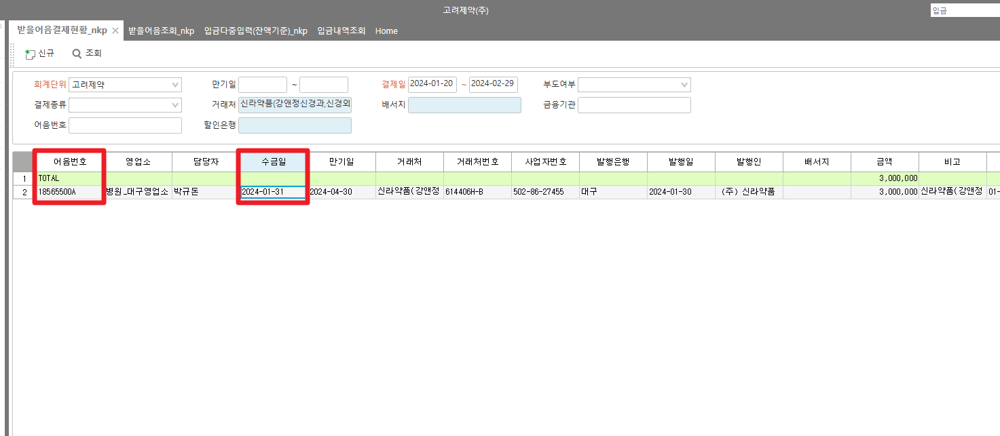
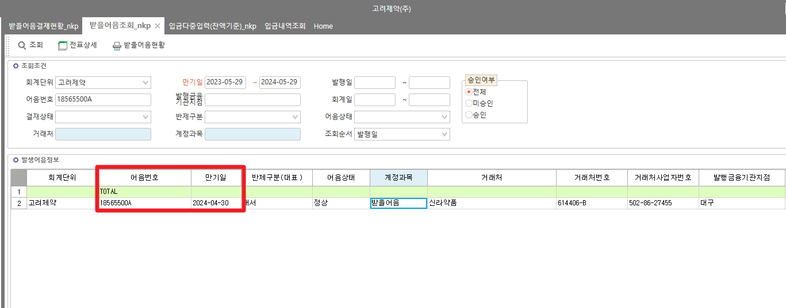
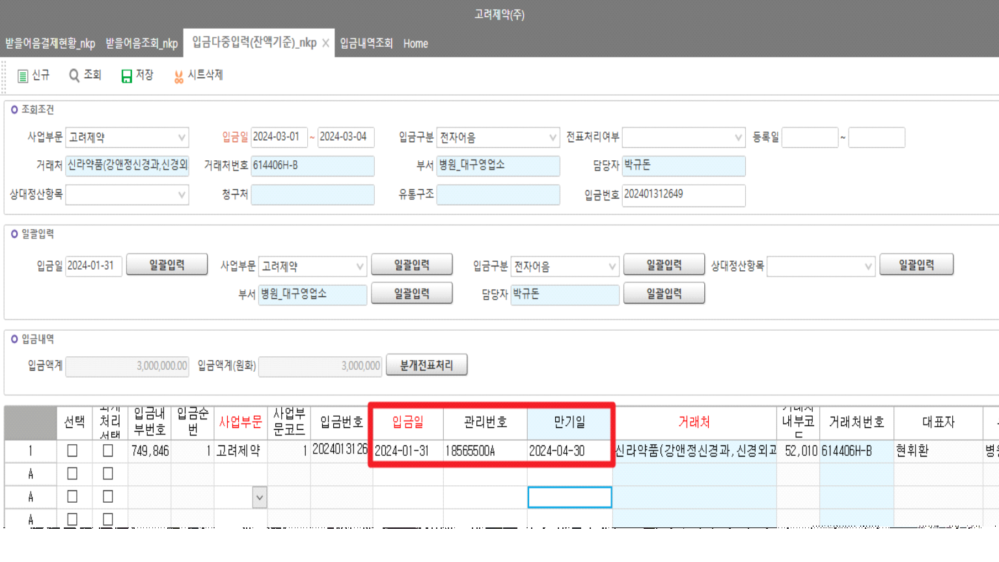

# 받을어음결제현황_nkp - \_TSLReceiptDesc

SELECT TOP 100

A.DueDate ,

A.DrawDate,

A.BillNo,

A.DueDate,

D.ReceiptDate

,D.ReceiptDate

,D.ReceiptNo

,A.\*

FROM \_TACBill AS A WITH(NOLOCK)

LEFT OUTER JOIN \_TSLReceiptDesc AS C WITH(NOLOCK) ON A.CompanySeq = C.CompanySeq -- 입금내역

AND A.BillNo = C.AdminNo

AND A.DueDate = C.DueDate

LEFT OUTER JOIN \_TSLReceipt AS D WITH(NOLOCK) ON C.CompanySeq = D.CompanySeq

AND C.ReceiptSeq = D.ReceiptSeq

--WHERE D.ReceiptNo ='202402290810'

WHERE A.BillNo = '18565500A'

ORDER BY D.ReceiptDate DESC

 

 

\[받을어음결제현황_nkp\] 화면의 ' 수금일' 컬럼의 경우

해당 어음 건에 연결된 입금 건의 입금일을 가져오고 있습니다.

| \* 어음  | \* 입금  |
|----------|----------|
| 어음번호 | 관리번호 |
| 만기일   | 만기일   |

확인 부탁 드립니다.

 

감사합니다.



 

 

출처: \<<http://61.250.183.6:8100/Page/Open/55299/100101/0/18820244>\>