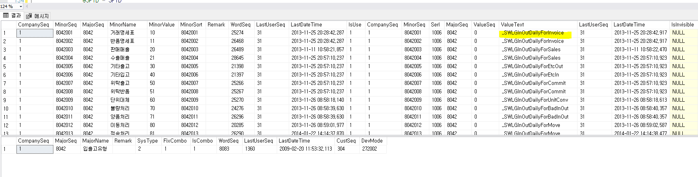

# 거래명세서 출고 시 없는 품목에 대한 현재고 체크

해당 품목이 세트품인 경우

 

 

SELECT \*

FROM \_TDASMinor AS B

JOIN \_TDASMinorValue AS C WITH(NOLOCK) ON B.CompanySeq = C.CompanySeq

AND B.MinorSeq = C.MinorSeq

AND C.Serl = 1006

WHERE B.CompanySeq = 1

AND B.MajorSeq = 8042

SELECT \* FROM \_TDASMajor WHERE MajorSeq = 8042

 

