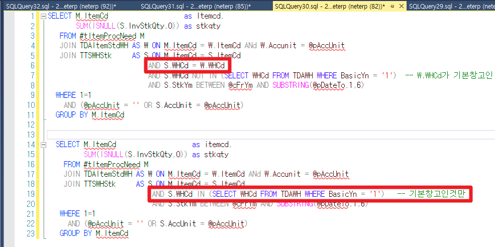

# 시스템베이스 - 소요량산출\* / 현재고 조회

현재고 조회 : 재고현황(계산서)\* ylwa09042_sb

 

 

 

소요량산출\* 자재조회 : SPPMatNeed2Qry_sb

 

select Temp.Itemcd, SUM(ISNULL(Temp.Stkqty,0))

From ( SELECT

M.ItemCd as Itemcd,

SUM(ISNULL(S.InvStkQty,0)) as stkqty

FROM \#tItemProcNeed M

--JOIN tdaitemmaster W ON M.ItemCd = W.ItemCd

JOIN TDAItemStdWH W ON M.ItemCd = W.ItemCd ANd W.Accunit = @pAccUnit

JOIN TTSWHStk S ON M.ItemCd = S.ItemCd

--AND S.AccUnit = W.Accunit 230726 품목테이블 AccUnit이 1만 등록되어 있어 JOIN시키지 않음 DHKOO

AND S.WHCd = W.WHCd

--AND S.WHCd IN (SELECT WHCd FROM TDAWH WHERE BasicYn = '1') -- 기본창고인것만

AND S.WHCd NOT IN (SELECT WHCd FROM TDAWH WHERE BasicYn = '1') -- W.WHCd가 기본창고인 경우 중복으로 데이터 생성 =\> 해당 구문 추가 24.03.28 SJPARK

 

AND S.StkYm BETWEEN @cFrYm AND SUBSTRING(@pDateTo,1,6)

--AND S.StkType = '1'

WHERE 1=1

AND (@pAccUnit = '' OR S.AccUnit = @pAccUnit)

GROUP BY M.ItemCd

Union all

SELECT

M.ItemCd as itemcd,

SUM(ISNULL(S.InvStkQty,0)) as stkqty

FROM \#tItemProcNeed M

--JOIN tdaitemmaster W ON M.ItemCd = W.ItemCd

JOIN TDAItemStdWH W ON M.ItemCd = W.ItemCd ANd W.Accunit = @pAccUnit

> JOIN TTSWHStk S ON M.ItemCd = S.ItemCd

--AND S.AccUnit = W.Accunit 230726 품목테이블 AccUnit이 1만 등록되어 있어 JOIN시키지 않음 DHKOO

AND S.WHCd IN (SELECT WHCd FROM TDAWH WHERE BasicYn = '1') -- 기본창고인것만

AND S.StkYm BETWEEN @cFrYm AND SUBSTRING(@pDateTo,1,6)

WHERE 1=1

AND (@pAccUnit = '' OR S.AccUnit = @pAccUnit)

GROUP BY M.ItemCd ) temp

group by Temp.Itemcd

