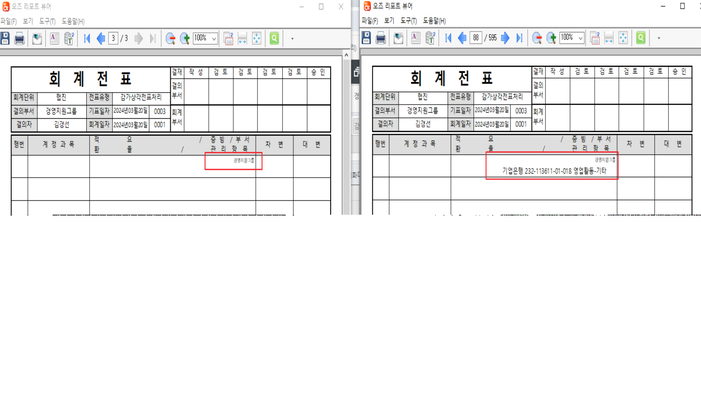

# 

전표 출력 시, 페이지 수가 2장 이상이고 전표행 수가 9개로 출력 종료될 때

마지막 장에 아래와 같이 계정과목 및 금액은 존재하지 않고 관리항목, 부서 등의 데이터만 출력 됩니다.

\[전표입력\] 화면에서 출력한 출력물과 \[전표연속출력\] 화면에서 출력한 출력물의 양상이 다른 것으로 확인됩니다.

마지막 장에 위와 같이 불필요한 데이터가 출력되지 않도록 수정 요청 드립니다.

확인 부탁 드립니다. 감사합니다.