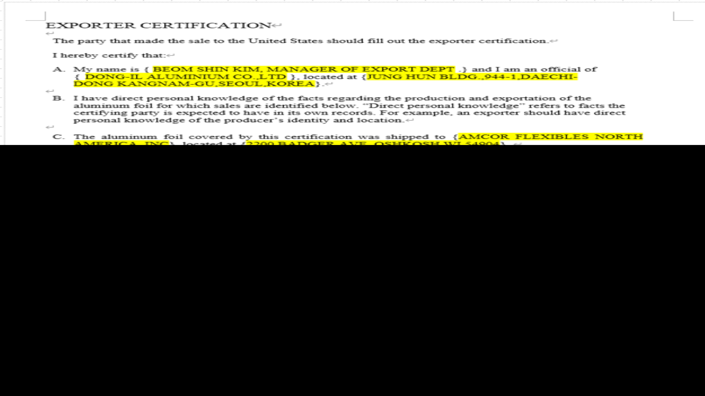

# 

 

 

EXPORTER CERTIFICATION

 

The party that made the sale to the United States should fill out the exporter certification.

 

1 hereby certify that:

 

A. My name is { @@@@ .} and I am an official of

( @@@@ }, located at {@@@@}.

 

B. I have direct personal knowledge of the facts regarding the production and exportation of the

aluminum foil for which 521t5 are identified be101넣- 'Direct personal knowledge" refers to facts the

certifying party is expected to have in its records. For example, an exporter should have direct

personal knowledge of the producers Id훼11다 and 1圓au에.

C. The alummum foil covered this certification 1\`'龜 shipped to {AMCOR FLEXIBLES NORTH

AMERICA, INC} , located at {2200 BADGER AVE, OSHKOSH 1Ⅵ 54904} -

D. The seller certifies that the aluminum f01! produced in (REPUBLIC OF KOREA} that IS covered

thiscatlficatton 1\`그§ not manufactured usmg 긔ununum f,이1 and/or sheet produced m China,

regardless Ofwhether sourced directly from Chmese producer or from a downstream supplier-

E. The aluminum f이1 covered this certification is not covered by 11” antidumpmg duty “

counten긔Img duty orders on catam alummum fi이1 from the People's Republic of Chma-

This certification applies to the followtng sales 10 { AMCOR FLEXIBLES NORTH AMERICA.

INC }, 10%1&4 at {2200 BADGER AVE, OSHKOSH WI 54904} (repeat this block as many tunes

as necessary):

Foreign Seller's Invoice 10 U .S. Customer. DIA23D122701•」

Foreign Seller's Invoice to U.S. Customer PO수: 237177국

Foreign Seller's Invoice to U S. Customer Line Item 0003325Ⅸ다正S X 46-125표(다正S X COIL

Foreign Seller 5 Invoice to U.S Customer Line Item 0003325Ⅸ다正S X 46-125Ⅸ다正S X COIL

Producer Name. DONG-IL AL UMINIUM CO.,LTD—

Producer 5 Address: JUNG Ht.mt BLDG 十44 IDAECHI-DONG KANGNAM-GU.SEOUL.KOREAe

5 Invoice 10 theFor이!씌두리까望: NA (If!heforeign 교!!” and theproducer are the

sameparty, report "NA ” here)e

G. 1 understand that { DONG-IL ALUMINUM CO.LTD IS required 10 maintain a copy 0f1h15

certification and sufflcrent documentation supporting this certification (i.e. , documents maintamed m

the normal course Ofbusmess, 0\[ documents Obtained 한 the celti\$mg party, for example, product

spectficauon sheets. customer specvfication sheets, production records,invoices. etc.) until 11鸞 later

or. (1) the date that is 『ive years after 11” latest entry date of the entnes col.ered 인le c해1ⅲc기i예;

\(2\) the date that is three years after the conclusion ofany lltlgatton m United States courts

regarding such

테 1 understand that { DONG-IL ALUMINUM CO.LTD 1” required to 한0171de the U.S. unpotter With

a copy ofthE certification and is required to provide C Customs and BorderProtection (CBP)

and/or the U -S. Department ofCommerce (Commerce) 1\`卍h this certification, and any supporting