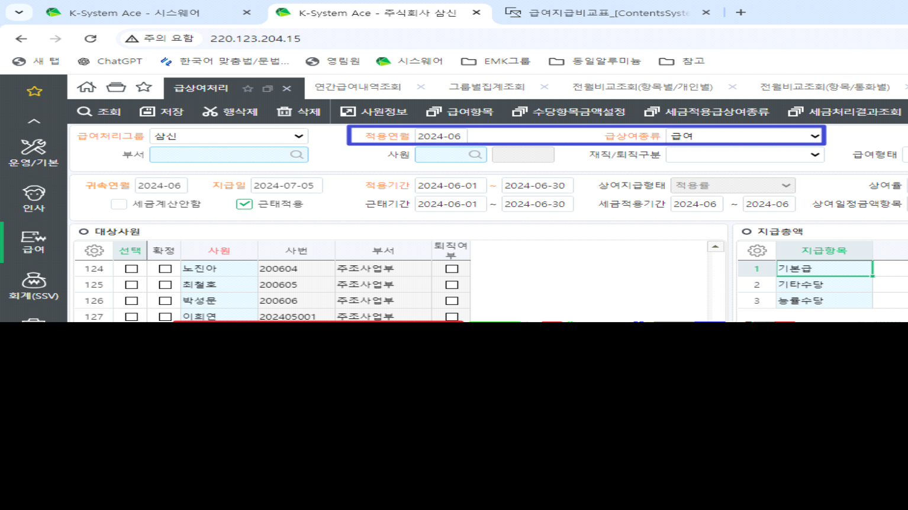
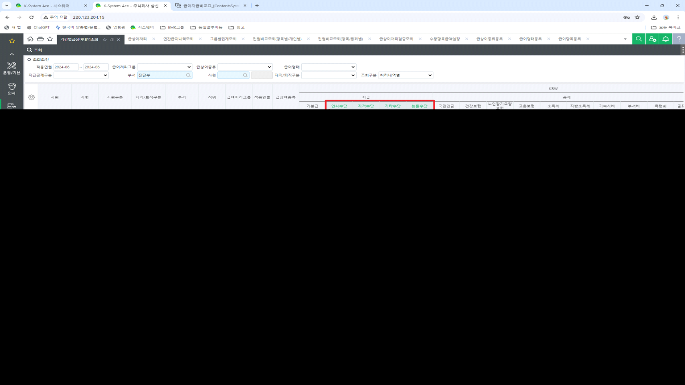

# 

안녕하세요. 운영팀 이다은입니다.

 

**1. 표준 \[연간급여내역조회\] 와 개발화면 \[급여지급비교표_ssv\]의 부서 인원이 다릅니다. (그림1)**

실서버: 2024-6, 급상여종류 '급여'

확인대상부서: 진단부 (표준:11명, 개발화면: 19명)

\>부서인원은 급상여처리결과 \[부서\]인원이 집계되어야 함 (그림2) 참고

 

**2. '제수당' 집계정보가 다릅니다.(그림3)**

실서버: 2024-6, 급상여종류 '급여'

확인대상부서: 진단부 (표준:기간별급상여내역조회(기본급 외 합계)와 비교)

<u>제수당설정: 수당항목금설정 \[제수당\]으로 산식 설정되어 있는 값이 산출되어야 함</u>

상세내용 아래 이미지 참고

 

 

이미지 확인 부탁드립니다. 감사합니다.

 

(그림1)

(그림2)

(그림3)

 

출처: \<<http://61.250.183.6:8100/Page/Open/63713/100101/0/18820244>\>