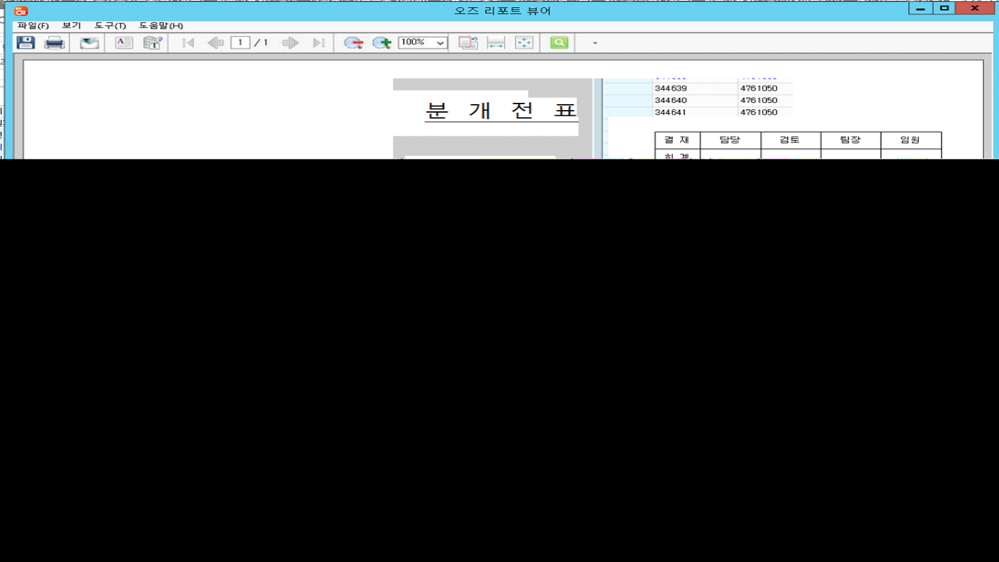

# 24.07.25 단암 계정과목 합산하여 출력되는 현상

안녕하세요. 운영지원팀 윤현지입니다.

 

\[분개전표입력\] 화면에서 전표분개유형: 프로젝트구매외주입고정산처리, 기표번호(DANAM-S0-20220531-0376) 번 전표 출력 시

 

기타지급수수료(연) 계정과목의 금액만 합산 되어 출력 되는 상태입니다. (그림1,2 참고)

 

(그림1)

(그림2)

 

\[분개전표입력\] 화면에서 전표분개유형: 선급비용대체처리, 기표번호(DANAM-S0-20230131-0127) 번 출력 시에는 

기타지급수수료(연) 계정과목의 금액이 합산 되지 않고 각각 금액이 출력 되는 상태입니다. (그림3,4 참고)

 

하여 프로젝트구매외주입고정산처리 전표분개유형의 기타지급수수료(연) 계정과목만 어떠한 이유로 금액이 합산 되어 나오는 것인지 확인 요청 드립니다.

만약 별도의 설정 값 때문에 금액이 합산 되어 나온 것이라면 해당 설정 값 전달 부탁드립니다.

 

(그림3)

(그림4)

 

확인 부탁드립니다. 감사합니다!

 

 

출처: \<<http://61.250.183.6:8100/Page/Open/65090/100101/0/18820244>\>