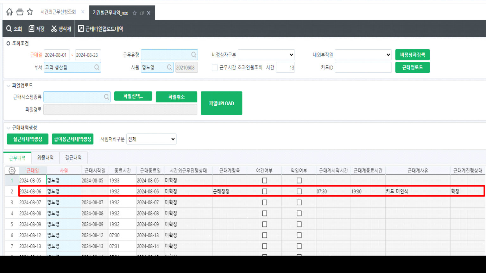
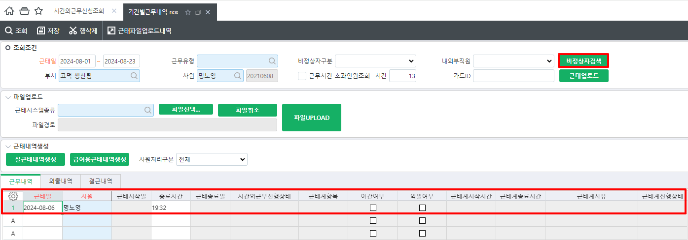
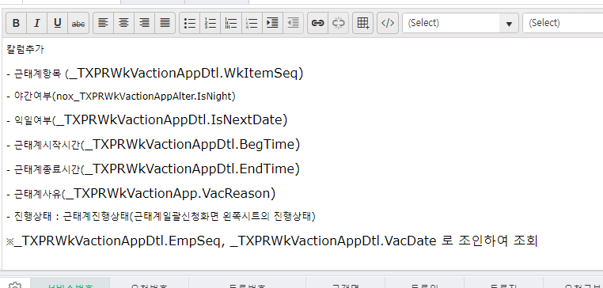

# 24.08.23 녹수 - 기간별근무내역

안녕하세요. 운영팀 윤현지입니다.



\[기간별근무내역_nox\] 화면에서 조회 시 시간외근무진행상태, 근태계항목, 근태계시작 및 종료시간, 진행상태, 근태계사유 등이 조회 되고 있으나 (그림1 참고)

해당 화면에서 비정상자검색 시에는 해당 값이 조회 되지 않습니다. (그림2 참고)

하여 \[기간별근무내역_nox\] 화면에서 비정상자 조회 시에도 해당 값 보여질 수 있도록 수정 요청 드립니다. (그림3 참고)



그림1)

그림2)

그림3)

 

 

nox_SXPRWkEmpWorkTimeQuery

 

nox_SXPRWkEmpWorkTimeErrQuery