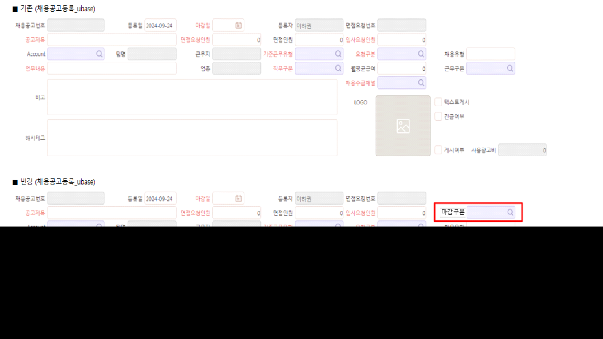

# 

안녕하세요. 운영팀 이다은입니다.

채용공고등록_ubase 화면

UMClosingTypeName - "마감구분" ubase_마감구분

콤보박스 항목 추가 부탁드립니다. 자세한 위치는 이미지 참고 부탁드립니다.

 

 

AgentCost - 대행비 텍스트입력 항목 추가 부탁드립니다. 자세한 위치는 이미지 참고 부탁드립니다.

 

\- 마감구분 항목의 값의 경우 사용자정의코드등록 화면에서 추가 할 수 있도록 부탁드립니다.

 

 

 

\- \[채용공고등록_ubase\] 화면 마감구분 칼럼에 입력하여 저장한 내용이 \[인당채용Fee현황_ubase\] 화면에서 '마감구분' 명칭의 신규 칼럼으로 결과가 조회 되도록 수정 부탁드립니다.

 

확인 부탁드립니다.

감사합니다. 

 

출처: \<<http://61.250.183.6:8100/Page/Open/69652/100101/0/18820244>\>

안녕하세요. 운영팀 이다은입니다.

 

채용공고등록_ubase 화면