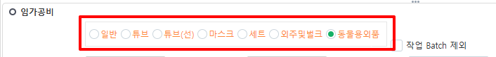
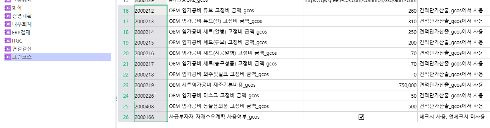
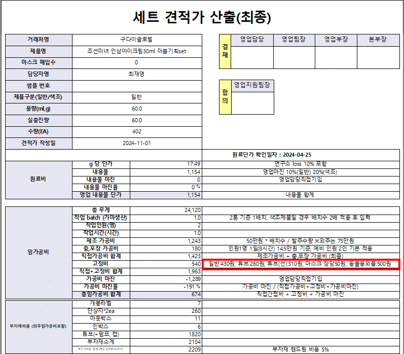

# 24.11.26 그린코스 견적단가산출_gcos

안녕하세요. 운영팀 윤현지입니다.



\[견적단가산출_gcos\] 화면 옵션박스 수정 및 견적단가표(OEM) 출력물 수정 요청 드립니다.



1\. 옵션박스에서 "콤보박스로" 수정 부탁드립니다.

현재 \[견적단가산출_gcos\] 화면 임가공비 항목 옵션박스로 되어있으며 change 이벤트가 있습니다.

-\> "콤보박스" 로 수정 요청 드리며, change 이벤트도 반영 되어야 합니다.



1-1. 임가공비 "동물용외품(튜브)" 추가 부탁드립니다.

\[환경설정(개발자)\] \> 그린코스 환경설정에도 고정비 330원으로 추가해 주세요.



2\. 견적단가표(OEM) 출력물 수정 요청 드립니다.

(\[견적단가산출_gcos\] 화면 상단에 견적단가표(OEM) 출력물 입니다.)                 

출력물 상 고정비 우측 비고 컬럼에 추가한 동물용외품(튜브) 출력 되게 해주세요.

확인 부탁드립니다. 감사합니다.

 

출처: \<<http://61.250.183.6:8100/Page/Open/73090/100101/0/18820244>\>