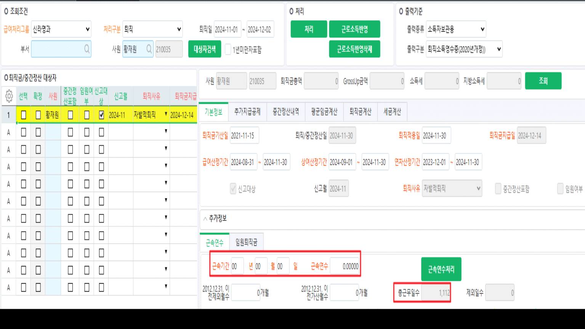

# 24.12.04 신라명과 퇴직금처리

안녕하세요. 운영지원팀 권새연입니다.

 

\[퇴직금처리\] 화면에서 근속연수 계산 시 근속기간, 근속연수가 집계되지 않습니다.

현재 사이트용sp로 계산되는 것으로 보여 근속기간, 근속연수가 집계될 수 있도록 수정 부탁드립니다.

\[퇴직금처리\] 화면에서 퇴직일 11월로 조회 후 황재원님 '처리' 해주시거나 '근속연수처리' 해주시면 됩니다.

추가로, 현재 테스트 서버에서는 근속기간, 근속연수 정상적으로 집계되고 있습니다.

 

sp명 : shilla_SXPRRetWkYearCr

 

확인 부탁드립니다. 감사합니다.