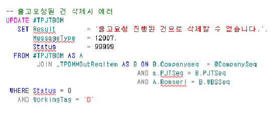

# 24.12.24 단암 자재출고요청 삭제해야하는 건

--SELECT \* FROM \_TPJTPROJECT WHERE PJTNO = 'GA210605AS001'

--SELECT \* FROM \_TPJTBOM WHERE PJTSeq = 15273

SELECT D.ItemNo,C.ItemNo,B.\*

FROM \_TPJTBOM AS A

JOIN \_TPDMMOutReqItem AS B ON B.Companyseq = 1

AND a.PJTSeq = B.PJTSeq

AND A.Bomserl = B.WBSSeq

LEFT OUTER JOIN \_TDAITEM AS C ON C.Companyseq = 1

AND A.ITEMSEQ = C.ITEMSEQ

LEFT OUTER JOIN \_TDAITEM AS D ON D.Companyseq = 1

AND D.ITEMSEQ = B.ITEMSEQ

 

WHERE A.PJTSeq = 15273

AND (

(BOMLEVEL = '1.02.1.03' AND C.ITEMNO = '1800010')

OR (BOMLEVEL ='1.02.1.03' AND C.ITEMNO = '1800010')

OR (BOMLEVEL ='1.02.1.05' AND C.ITEMNO = '1700036')

OR (BOMLEVEL ='1.02.1.10' AND C.ITEMNO = '1100556')

OR (BOMLEVEL ='1.02.1.19' AND C.ITEMNO = '1100277')

OR (BOMLEVEL ='1.02.1.20' AND C.ITEMNO = '1100050')

OR (BOMLEVEL ='1.02.1.21' AND C.ITEMNO = '1100996')

OR (BOMLEVEL ='1.02.1.22' AND C.ITEMNO = '1700235')

OR (BOMLEVEL ='1.02.1.25' AND C.ITEMNO = '1300088')

OR (BOMLEVEL ='1.02.1.31' AND C.ITEMNO = '1301043')

OR (BOMLEVEL ='1.02.1.37' AND C.ITEMNO = '1300196')

OR (BOMLEVEL ='1.02.1.45' AND C.ITEMNO = '1201221')

OR (BOMLEVEL ='1.02.1.49' AND C.ITEMNO = '1200718')

OR (BOMLEVEL ='1.02.1.60' AND C.ITEMNO = '1300638')

OR (BOMLEVEL ='1.02.1.62' AND C.ITEMNO = '1300442')

OR (BOMLEVEL ='1.02.1.73' AND C.ITEMNO = '1200015')

OR (BOMLEVEL ='1.02.1.76' AND C.ITEMNO = '1300106')

)

 

SELECT C.ItemNo,\*

FROM \_TPDMMOutReqItem AS A

JOIN \_TDAITEM AS C ON C.Companyseq = 1

AND a.ITEMSEQ = C.ITEMSEQ

WHERE OutReqSeq = 54085

AND OutReqItemSerl IN(

1

,3

,4

,6

,83

,85

,80

,72

,67

,65

,57

,53

,39

,43

,30

,15

)

 

 

SELECT \*

FROM \_TPDMMOutReqM

WHERE OutReqSeq = 54085

프로젝트재료자원에서 해당 건 들 삭제가 안됨

sp : danam_SPJTResrcBOMAddCheck

=\> 자재출고요청 건이 존재

=\> 자재출고요청에서 품목을 변경한 건들

