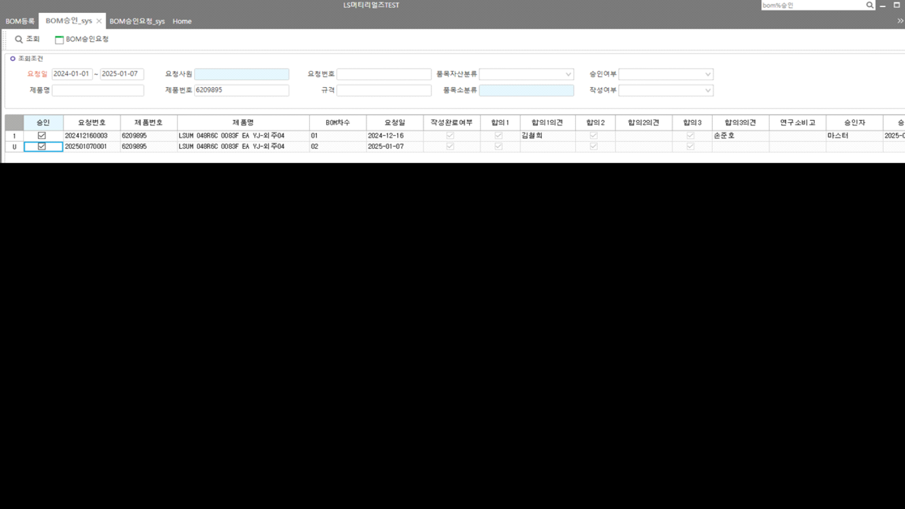

# 25.01.07 엘에스머트리얼즈 BOM승인 - 승인 테스트 서버 오류 건

DROP PROC sys_SWPDBOMCfmSave_TTEST

GO

CREATE PROC sys_SWPDBOMCfmSave_TTEST

@xmlDocument NVARCHAR(MAX) ,

@xmlFlags INT = 0,

@ServiceSeq INT = 0,

@WorkingTag NVARCHAR(10)= '',

@CompanySeq INT = 1,

@LanguageSeq INT = 1,

@UserSeq INT = 0,

@PgmSeq INT = 0

AS

DECLARE @MessageType INT,

@Status INT,

@Results NVARCHAR(250),

@ItemSeq INT,

@XmlDoc NVARCHAR(MAX),

@ItemBOMRev NCHAR(2),

@OriItemBOMRev NCHAR(2),

@StdDate NCHAR(8)

-- 서비스 마스타 등록 생성

CREATE TABLE \#TPDBOMManagement (WorkingTag NCHAR(1) NULL)

EXEC dbo.\_SCAOpenXmlToTemp @xmlDocument, @xmlFlags, @CompanySeq, @ServiceSeq, 'DataBlock1', '#TPDBOMManagement'

IF @@ERROR \<\> 0 RETURN

ALTER TABLE \#TPDBOMManagement ADD Serl INT

EXEC dbo.\_SCOMMessage @MessageType OUTPUT,

@Status OUTPUT,

@Results OUTPUT,

6 , -- 중복된 @1 @2가(이) 입력되었습니다.(SELECT \* FROM \_TCAMessageLanguage WHERE MessageSeq = 6)

@LanguageSeq ,

0,''

UPDATE \#TPDBOMManagement

SET Result = N'이미 BOM이 구성된 품목입니다.',

MessageType = @MessageType ,

Status = @Status

FROM \#TPDBOMManagement AS A

JOIN \_TPDBOM AS B WITH(NOLOCK) ON B.CompanySeq = @CompanySeq

AND B.ItemSeq = A.ItemSeqTree

AND B.ItemBOMRev = A.ItemBomRevTree

WHERE A.Status = 0

AND A.WorkingTag IN ('A','U')

-- 실테이블 기준으로 체크하도록 'sys_TPDBOMReqManagement' JOIN 절 추가 23.12.29 SJPARK

EXEC dbo.\_SCOMMessage @MessageType OUTPUT,

@Status OUTPUT,

@Results OUTPUT,

6 , -- 중복된 @1 @2가(이) 입력되었습니다.(SELECT \* FROM \_TCAMessageLanguage WHERE MessageSeq = 6)

@LanguageSeq ,

0,'' -- SELECT \* FROM \_TCADictionary WHERE Word like '%거래처%'

UPDATE \#TPDBOMManagement

SET Result = CASE WHEN ISNULL(B.Agree1,'0') = '0' THEN N'합의1 승인하지 않았습니다.'

WHEN ISNULL(B.Agree2,'0') = '0' THEN N'합의2 승인하지 않았습니다.'

WHEN ISNULL(B.Agree3,'0') = '0' THEN N'합의3 승인하지 않았습니다.'

--WHEN ISNULL(CheckDelvTeamManager,'0') = '0' THEN N'개발팀장 승인하지 않았습니다.'

ELSE '' END,

MessageType = @MessageType,

Status = @Status

FROM \#TPDBOMManagement AS A

JOIN sys_TPDBOMReqManagement AS B WITH(NOLOCK) ON B.CompanySeq = @CompanySeq

AND B.BOMReqSeq = A.BOMReqSeq

WHERE WorkingTag IN ('A','U')

AND Status = 0

AND ((ISNULL(B.Agree1,'0') = '0')

OR (ISNULL(B.Agree2,'0') = '0')

OR (ISNULL(B.Agree3,'0') = '0')

--OR (ISNULL(CheckDelvTeamManager,'0') = '0')

)

 

IF EXISTS ( SELECT 1 FROM \#TPDBOMManagement WHERE Status \<\> 0)

BEGIN

SELECT \* FROM \#TPDBOMManagement

RETURN

END

-- 20240709.역전개 로직 추가

CREATE TABLE \#ReversedBOM

(

CompanySeq INT NOT NULL,

Seq INT NOT NULL,

ParentSeq INT NOT NULL,

ItemSeq INT NOT NULL,

Sort INT NOT NULL,

TreeLevel INT NOT NULL,

ItemRev CHAR(4) NOT NULL,

NeedQtyNumerator DECIMAL(20,10) null,

NeedQtyDenominator DECIMAL(20,10) null,

TextLevel NVARCHAR(60) null

)

-- 역전개 통해 상위 품목에 대한 정보 가져오기

SELECT @ItemSeq = A.ItemSeqTree,

@ItemBOMRev = A.ItemBomRevTree

FROM \#TPDBOMManagement AS A

WHERE A.Status = 0

--AND A.WorkingTag = 'D'

-- 승인취소

IF EXISTS ( SELECT 1 FROM \#TPDBOMManagement WHERE Status = 0 AND WorkingTag = 'D')

BEGIN

--SELECT @ItemBOMRev = RIGHT('00' + CONVERT(NVARCHAR, CONVERT(INT, @ItemBOMRev) -1),2)

INSERT INTO \#ReversedBOM

SELECT @CompanySeq, 1, 0, @ItemSeq, 1, 1, @ItemBOMRev, 1, 1, '1'

EXEC \_SPDReversBOM @CompanySeq, @ItemSeq, @ItemBOMRev, 1, 1, 0, '1'

DELETE \#ReversedBOM FROM \#ReversedBOM WHERE NeedQtyDenominator = 0 -- 소요량이 필수이기 때문에 분모가 0인 건은 삭제

END

-- 승인처리

IF EXISTS ( SELECT 1 FROM \#TPDBOMManagement WHERE Status = 0 AND WorkingTag = 'A')

BEGIN

SELECT @OriItemBOMRev = RIGHT('00' + CONVERT(NVARCHAR, CONVERT(INT, @ItemBOMRev) -1),2)

INSERT INTO \#ReversedBOM

SELECT @CompanySeq, 1, 0, @ItemSeq, 1, 1, @OriItemBOMRev, 1, 1, '1'

EXEC \_SPDReversBOM @CompanySeq, @ItemSeq, @OriItemBOMRev, 1, 1, 0, '1'

DELETE \#ReversedBOM FROM \#ReversedBOM WHERE NeedQtyDenominator = 0 -- 소요량이 필수이기 때문에 분모가 0인 건은 삭제

END

SELECT @StdDate = CONVERT(NCHAR(8), GETDATE(), 112)

 

-- 승인 취소

IF EXISTS ( SELECT 1 FROM \#TPDBOMManagement WHERE Status = 0 AND WorkingTag = 'D')

BEGIN

DELETE \_TPDBOMRemarks

FROM \_TPDBOMRemarks AS A

JOIN sys_TPDBOMRemarksReq C WITH(NOLOCK) ON A.ItemSeq = C.ItemSeq

AND A.ItemBomRev = C.ItemBomRev

AND A.CompanySeq = C.CompanySeq

JOIN \#TPDBOMManagement AS B ON A.ItemSeq = B.ItemSeqTree

--AND A.Serl = B.Serl

WHERE B.WorkingTag = 'D'

AND B.Status = 0

AND A.CompanySeq = @CompanySeq

--AND A.ItemBomRev = '00'

AND A.ItemBomRev = B.ItemBomRevTree

IF @@ERROR \<\> 0 RETURN

DELETE \_TPDBOMProc

FROM \_TPDBOMProc AS A

JOIN sys_TPDBOMProcReq C WITH(NOLOCK) ON A.ItemSeq = C.ItemSeq

AND A.ItemBomRev = C.ItemBomRev

AND A.CompanySeq = C.CompanySeq

AND A.SubItemSeq = C.SubItemSeq

AND A.SubItemBomRev = C.SubItemBomRev

AND A.GoodSeq = C.GoodSeq

AND A.GoodBomRev = C.GoodBomRev

AND A.ProcRev = C.ProcRev

JOIN \#TPDBOMManagement AS B ON A.ItemSeq = B.ItemSeqTree

WHERE B.WorkingTag = 'D'

AND B.Status = 0

AND A.CompanySeq = @CompanySeq

--AND A.ItemBomRev = '00'

AND A.ItemBomRev = B.ItemBomRevTree

IF @@ERROR \<\> 0 RETURN

DELETE \_TPDBOM

FROM \_TPDBOM AS A

JOIN sys_TPDBOMReq C WITH(NOLOCK) ON A.CompanySeq = C.CompanySeq

AND A.ItemSeq = C.ItemSeq

AND A.ItemBomRev = C.ItemBomRev

AND A.SubItemSeq = C.SubItemSeq

AND A.SubItemBomRev = C.SubItemBomRev

JOIN \#TPDBOMManagement AS B ON A.ItemSeq = B.ItemSeqTree

--AND A.Serl = B.Serl

WHERE B.WorkingTag = 'D'

AND B.Status = 0

AND A.CompanySeq = @CompanySeq

--AND A.ItemBomRev = '00'

AND A.ItemBomRev = B.ItemBomRevTree

IF @@ERROR \<\> 0 RETURN

-- 하위품목 삭제시 모품목 Management에 최종수정일 업데이트 -- 11.07.08 BY 김세호

UPDATE \_TPDBOMManagement

SET LastUptDate = CONVERT(NCHAR(8), GETDATE(),112)

FROM \_TPDBOMManagement A WITH(NOLOCK)

JOIN \#TPDBOMManagement B ON A.ItemSeq = B.ItemSeqTree

WHERE A.ItemBomRev = B.ItemBomRevTree

AND A.CompanySeq = @CompanySeq

-- 하위품목 모두 삭제 됐을경우 모품목 BOMManagement 데이터 삭제 -- 11.07.08 BY 김세호

IF NOT EXISTS(SELECT 1

FROM \_TPDBOM AS A

JOIN \#TPDBOMManagement AS B ON A.ItemSeq = B.ItemSeqTree

--AND A.Serl = B.Serl

WHERE B.WorkingTag = 'D'

AND B.Status = 0

AND A.CompanySeq = @CompanySeq

--AND A.ItemBomRev = '00'

AND A.ItemBomRev = B.ItemBomRevTree

)

BEGIN

-- 차수정보 로그 남기기

SELECT DISTINCT A.\*,

CONVERT(NVARCHAR(10),'D') AS WorkingTag,

CONVERT(INT, 0) AS Status

INTO \#TPDBOMManagement1

FROM \_TPDBOMManagement AS A

JOIN \#TPDBOMManagement AS B ON A.CompanySeq = @CompanySeq

AND A.ItemSeq = B.ItemSeqTree

AND A.ItemBomRev = '00'

-- 로그테이블 남기기(마지막 파라메터는 반드시 한줄로 보내기)

EXEC \_SCOMLog @CompanySeq ,

@UserSeq ,

'\_TPDBOMManagement', -- 원테이블명

'#TPDBOMManagement1', -- 템프테이블명

'ItemSeq, ItemBomRev' , -- 키가 여러개일 경우는 , 로 연결한다.

'CompanySeq, ItemSeq, ItemBomRev, RegDate, LastUptDate, FrTermValidity, ToTermValidity, BatchSize, Remark, LastUserSeq, LastDateTime, FileSeq, ItemBOMRevRemark, RegDateTime'

DELETE \_TPDBOMManagement

FROM \_TPDBOMManagement A

JOIN \#TPDBOMManagement B ON A.ItemSeq = B.ItemSeqTree

WHERE A.ItemBomRev = '00'

AND A.CompanySeq = @CompanySeq

END

-- 20240709.Upper BOM 삭제

DELETE FROM \#ReversedBOM WHERE ItemSeq = @ItemSeq AND ItemRev = @ItemBOMRev

SELECT A.\*,

CONVERT(NVARCHAR(10),'D') AS WorkingTag,

CONVERT(INT, 0) AS Status

INTO \#TPDBOMLog

FROM \_TPDBOM AS A

JOIN \#ReversedBOM C WITH(NOLOCK) ON A.CompanySeq = C.CompanySeq

AND A.ItemSeq = C.ItemSeq

AND A.ItemBomRev = C.ItemRev

WHERE A.CompanySeq = @CompanySeq

 

-- 로그테이블 남기기(마지막 파라메터는 반드시 한줄로 보내기)

EXEC \_SCOMLog @CompanySeq ,

@UserSeq ,

'\_TPDBOM', -- 원테이블명

'#TPDBOMLog', -- 템프테이블명

'ItemSeq, ItemBomRev, Serl' , -- 키가 여러개일 경우는 , 로 연결한다.

'CompanySeq,ItemSeq,ItemBomRev,Serl,UserSeq,SubItemSeq,SubItemBomRev,UnitSeq,SubUnitSeq,NeedQtyNumerator,NeedQtyDenominator,HaveChild,InLossRate,OutLossRate,

ECOSeq,ECOItemSerl,ECOChangeSerl,ECOApplySerl,FrApplyDate,ToApplyDate,Location,Remark,IsCfm,LastUserSeq,LastDateTime,SMDelvType,PgmSeq'

 

SELECT A.\*,

CONVERT(NVARCHAR(10),'D') AS WorkingTag,

CONVERT(INT, 0) AS Status

INTO \#TPDBOMManagementLog

FROM \_TPDBOMManagement AS A

JOIN \#ReversedBOM C WITH(NOLOCK) ON A.CompanySeq = C.CompanySeq

AND A.ItemSeq = C.ItemSeq

AND A.ItemBomRev = C.ItemRev

WHERE A.CompanySeq = @CompanySeq

-- 로그테이블 남기기(마지막 파라메터는 반드시 한줄로 보내기)

EXEC \_SCOMLog @CompanySeq ,

@UserSeq ,

'\_TPDBOMManagement', -- 원테이블명

'#TPDBOMManagementLog', -- 템프테이블명

'ItemSeq, ItemBomRev' , -- 키가 여러개일 경우는 , 로 연결한다.

'CompanySeq, ItemSeq, ItemBomRev, RegDate, LastUptDate, FrTermValidity, ToTermValidity, BatchSize, Remark, LastUserSeq, LastDateTime, FileSeq, ItemBOMRevRemark, RegDateTime'

DELETE \_TPDBOM

FROM \_TPDBOM AS A

JOIN \#ReversedBOM C WITH(NOLOCK) ON A.CompanySeq = C.CompanySeq

AND A.ItemSeq = C.ItemSeq

AND A.ItemBomRev = C.ItemRev

WHERE A.CompanySeq = @CompanySeq

IF @@ERROR \<\> 0 RETURN

DELETE \_TPDBOMManagement

FROM \_TPDBOMManagement AS A

JOIN \#ReversedBOM C WITH(NOLOCK) ON A.CompanySeq = C.CompanySeq

AND A.ItemSeq = C.ItemSeq

AND A.ItemBomRev = C.ItemRev

WHERE A.CompanySeq = @CompanySeq

IF @@ERROR \<\> 0 RETURN

 

SELECT \* FROM \#TPDBOMManagement

RETURN

END

IF EXISTS ( SELECT 1 FROM \#TPDBOMManagement WHERE Status = 0 AND WorkingTag = 'A')

BEGIN

-- 내부코드 채번

DECLARE @Count INT,

@Seq INT ,

@Date NCHAR(8),

@MaxNo NVARCHAR(50)

SELECT @Count = COUNT(1) FROM \#TPDBOMManagement WHERE WorkingTag = 'A' AND Status = 0

SELECT @Date = CONVERT(VARCHAR,GETDATE(),112)

IF @Count \> 0

BEGIN

EXEC @Seq = dbo.\_SCOMCreateSeq @CompanySeq, '\_TPDBOM', 'Serl', @Count

SELECT @Seq = ISNULL(@Seq, 0)

-- Temp Talbe 에 생성된 키값 UPDATE

UPDATE \#TPDBOMManagement

SET Serl = @Seq + DataSeq

WHERE WorkingTag = 'A'

AND Status = 0

END

--\_TPDBOMManagement

INSERT INTO \_TPDBOMManagement

(

CompanySeq , ItemSeq , ItemBomRev , RegDate , LastUptDate ,

FrTermValidity , ToTermValidity , BatchSize , Remark , LastUserSeq ,

LastDateTime , FileSeq , ItemBOMRevRemark , RegDateTime

)

SELECT @CompanySeq ,B.ItemSeq ,A.ItemBomRevTree , B.RegDate,B.LastUptDate ,

B.FrTermValidity ,B.ToTermValidity ,B.BatchSize , B.Remark ,@UserSeq ,

GETDATE() ,B.FileSeq ,B.ItemBOMRevRemark, GETDATE()

FROM \#TPDBOMManagement AS A

JOIN sys_TPDBOMReqManagement AS B WITH(NOLOCK) ON A.ItemSeqTree = B.ItemSeq

AND B.CompanySeq = @CompanySeq

AND A.ItemBomRevTree = B.ItemBOMRevRemark

LEFT OUTER JOIN \_TPDBOMManagement AS C WITH(NOLOCK) ON B.CompanySeq = C.CompanySeq

AND B.ItemSeq = C.ItemSeq

AND B.ItemBOMRevRemark = C.ItemBomRev

WHERE A.WorkingTag IN ('A','U')

AND A.Status = 0

AND C.CompanySeq IS NULL

IF @@ERROR \<\> 0 RETURN

 

-- \_TPDBOM

INSERT INTO \_TPDBOM

(

CompanySeq , ItemSeq , ItemBomRev , Serl , UserSeq ,

SubItemSeq , SubItemBomRev , UnitSeq , SubUnitSeq , NeedQtyNumerator ,

NeedQtyDenominator , HaveChild , InLossRate , OutLossRate , ECOSeq ,

ECOItemSerl , ECOChangeSerl , ECOApplySerl ,

FrApplyDate , ToApplyDate , Location , Remark , IsCfm ,

LastUserSeq , LastDateTime , SMDelvType, PgmSeq

)

SELECT @CompanySeq ,B.ItemSeq ,B.ItemBomRev ,B.Serl ,B.UserSeq ,

B.SubItemSeq ,B.SubItemBomRev ,B.UnitSeq ,B.SubUnitSeq ,B.NeedQtyNumerator ,

B.NeedQtyDenominator ,B.HaveChild ,B.InLossRate ,B.OutLossRate ,B.ECOSeq ,

B.ECOItemSerl , B.ECOChangeSerl , B.ECOApplySerl ,

B.FrApplyDate ,B.ToApplyDate ,B.Location ,B.Remark ,B.IsCfm ,

@UserSeq ,GETDATE() , B.SMDelvType ,@PgmSeq

FROM \#TPDBOMManagement AS A

JOIN sys_TPDBOMReq B ON B.ItemSeq = A.ItemSeqTree AND B.ItemBomRev = A.ItemBomRevTree AND B.CompanySeq = @CompanySeq

WHERE A.WorkingTag = 'A'

AND A.Status = 0

AND NOT EXISTS (SELECT 1 FROM \_TPDBOM WHERE CompanySeq = @CompanySeq AND ItemSeq = A.ItemSeqTree AND ItemBomRev = A.ItemBomRevTree)

IF @@ERROR \<\> 0 RETURN

--UPDATE P

-- SET HaveChild = '1'

-- FROM \_TPDBOM AS P

-- JOIN \#TPDBOMManagement AS A ON P.SubItemSeq = A.ItemSeq

-- AND P.SubItemBomRev = '00'

-- WHERE P.CompanySeq = @CompanySeq

-- IF @@ERROR \<\> 0 RETURN

-- UPDATE P

-- SET HaveChild = '1'

-- FROM \_TPDBOM AS P

-- JOIN (SELECT A.ItemSeq, '00' AS ItemBomRev, A.SubItemSeq, A.SubItemBomRev

-- FROM \#TPDBOMManagement AS A

-- JOIN \_TPDBOM AS B WITH(NOLOCK) ON B.ItemSeq = A.SubItemSeq

-- AND B.ItemBomRev = '00'

-- WHERE B.CompanySeq = @CompanySeq

-- ) AS O ON P.ItemSeq = O.ItemSeq

-- AND P.ItemBOMRev = O.ItemBomRev

-- AND P.SubItemSeq = O.SubItemSeq

-- AND P.SubItemBOMRev = O.SubItemBomRev

-- WHERE P.CompanySeq = @CompanySeq

-- IF @@ERROR \<\> 0 RETURN

--\_TPDBOMProc

INSERT INTO \_TPDBOMProc

(

CompanySeq,GoodSeq,GoodBomRev,ItemSeq,ItemBomRev,SubItemSeq,SubItemBomRev,

ProcRev,ProcSeq,WorkCenterSeq,LastUserSeq,LastDateTime

)

SELECT @CompanySeq ,A.GoodSeq,A.GoodBomRev,A.ItemSeq ,A.ItemBomRev ,A.SubItemSeq ,A.SubItemBomRev ,

A.ProcRev ,A.ProcSeq ,ISNULL(A.WorkCenterSeq, 0) ,@UserSeq ,GETDATE()

FROM sys_TPDBOMProcReq AS A

JOIN \#TPDBOMManagement R WITH(NOLOCK) ON A.ItemSeq = R.ItemSeqTree

JOIN \_TDAItem AS I WITH(NOLOCK) ON A.SubItemSeq = I.ItemSeq

AND I.CompanySeq = @CompanySeq

JOIN \_TDAItemAsset AS S WITH(NOLOCK) ON I.AssetSeq = S.AssetSeq

AND I.CompanySeq = S.CompanySeq

WHERE R.WorkingTag IN ('A','U')

AND R.Status = 0

AND A.CompanySeq = @CompanySeq

AND A.ProcRev \> ''

AND A.ProcSeq \> 0

AND S.SMAssetGrp IN (6008004, 6008005)

AND NOT EXISTS (SELECT 1 FROM \_TPDBOMProc WHERE CompanySeq = @CompanySeq

AND GoodSeq = A.GoodSeq -- 송기연 추가 공정품이 여러제품에 쓰일 경우 업데이트가 안되어 추가 20100402

AND GoodBOmRev = A.GoodBomRev -- 송기연 추가 공정품이 여러제품에 쓰일 경우 업데이트가 안되어 추가 20100402

AND ItemSeq = A.ItemSeq

AND ItemBomRev = A.ItemBomRev

AND SubItemSeq = A.SubItemSeq

AND SubItemBomRev = A.SubItemBomRev)

--AND ProcRev = A.ProcRev )

AND EXISTS (SELECT 1 FROM \_TPDROUItemProcRev WHERE CompanySeq = @CompanySeq

AND ItemSeq = A.GoodSeq

AND ItemSeq \> 0 )

IF @@ERROR \<\> 0 RETURN

--\_TPDBOMRemarks

INSERT INTO \_TPDBOMRemarks

(

CompanySeq,ItemSeq,ItemBomRev,Serl,

Remark1,Remark2,Remark3,Remark4,Remark5,

Remark6,Remark7,Remark8,Remark9,Remark10,

LastUserSeq,LastDateTime

)

SELECT @CompanySeq ,A.ItemSeq ,A.ItemBomRev ,B.Serl ,

ISNULL(A.Remark1,''),ISNULL(A.Remark2,''),ISNULL(A.Remark3,''),ISNULL(A.Remark4,''),ISNULL(A.Remark5,''),

ISNULL(A.Remark6,''),ISNULL(A.Remark7,''),ISNULL(A.Remark8,''),ISNULL(A.Remark9,''),ISNULL(A.Remark10,''),

@UserSeq ,GETDATE()

FROM sys_TPDBOMRemarksReq AS A

JOIN \#TPDBOMManagement B ON A.CompanySeq = @CompanySeq AND A.ItemSeq = B.ItemSeqTree

WHERE B.WorkingTag IN ('A','U')

AND B.Status = 0

AND NOT EXISTS (SELECT 1 FROM \_TPDBOMRemarks WHERE CompanySeq = @CompanySeq

AND ItemSeq = A.ItemSeq

AND ItemBomRev = A.ItemBomRev

AND Serl = B.Serl )

AND A.ItemBomRev = B.ItemBomRevTree

AND (A.Remark1 \> ''

OR A.Remark2 \> ''

OR A.Remark3 \> ''

OR A.Remark4 \> ''

OR A.Remark5 \> ''

OR A.Remark6 \> ''

OR A.Remark7 \> ''

OR A.Remark8 \> ''

OR A.Remark9 \> ''

OR A.Remark10 \> '')

IF @@ERROR \<\> 0 RETURN

-- 20240709.역전개 통해 생성된 BOM 생성

SELECT A.ItemSeq,

A.ItemRev AS OriItemRev,

CONVERT(NCHAR(2), '') AS ItemRev

INTO \#CreateUpperBom

FROM \#ReversedBOM AS A

WHERE A.ItemSeq \<\> @ItemSeq

 

-- @@@@ 업데이트 안됨

UPDATE A

SET ItemRev = RIGHT('00' + CONVERT(NVARCHAR, CONVERT(INT, B.MaxItemBomRev) + 1),2)

FROM \#CreateUpperBom AS A

JOIN (SELECT A.ItemSeq, MAX(A.ItemBomRev) AS MaxItemBomRev

FROM \_TPDBOMManagement AS A WITH(NOLOCK)

WHERE A.CompanySeq = @CompanySeq

AND A.ItemSeq IN (SELECT DISTINCT ItemSeq FROM \#CreateUpperBom)

GROUP BY A.ItemSeq) AS B ON A.ItemSeq = B.ItemSeq

 

 

INSERT INTO \_TPDBOMManagement

(

CompanySeq , ItemSeq , ItemBomRev , RegDate , LastUptDate ,

FrTermValidity , ToTermValidity , BatchSize , Remark , LastUserSeq ,

LastDateTime , FileSeq , ItemBOMRevRemark , RegDateTime

)

SELECT @CompanySeq, A.ItemSeq, A.ItemRev, @StdDate, @StdDate,

'' , '' , 0 , '' , @UserSeq,

GETDATE() , 0 , A.ItemRev, GETDATE()

FROM \#CreateUpperBom AS A

JOIN \_TPDBOMManagement AS B WITH(NOLOCK) ON B.CompanySeq = @CompanySeq

AND A.ItemSeq = B.ItemSeq

AND A.OriItemRev = B.ItemBomRev

IF @@ERROR \<\> 0 RETURN

INSERT INTO \_TPDBOM

(

CompanySeq , ItemSeq , ItemBomRev , Serl , UserSeq,

SubItemSeq , SubItemBomRev, UnitSeq , SubUnitSeq , NeedQtyNumerator,

NeedQtyDenominator, HaveChild , InLossRate , OutLossRate, ECOSeq,

ECOItemSerl , ECOChangeSerl, ECOApplySerl, FrApplyDate, ToApplyDate,

Location , Remark , IsCfm , LastUserSeq, LastDateTime,

SMDelvType , PgmSeq

)

SELECT @CompanySeq , A.ItemSeq , B.ItemRev , A.Serl , A.UserSeq ,

CASE WHEN ISNULL(C.ItemSeq,0) = 0 THEN A.SubItemSeq ELSE C.ItemSeq END AS SubItemSeq,

CASE WHEN A.SubItemSeq = @ItemSeq AND A.SubItemBomRev = @OriItemBOMRev THEN @ItemBOMRev ELSE (CASE WHEN ISNULL(C.ItemSeq,0) = 0 THEN A.SubItemBomRev ELSE C.ItemRev END) END AS SubItemBomRev,

A.UnitSeq , A.SubUnitSeq , A.NeedQtyNumerator ,

A.NeedQtyDenominator, A.HaveChild , A.InLossRate , A.OutLossRate, A.ECOSeq ,

A.ECOItemSerl , A.ECOChangeSerl, A.ECOApplySerl, A.FrApplyDate, A.ToApplyDate,

A.Location , A.Remark , A.IsCfm , @UserSeq , GETDATE(),

A.SMDelvType , @PgmSeq

FROM \_TPDBOM AS A WITH(NOLOCK)

JOIN \#CreateUpperBom AS B ON A.ItemSeq = B.ItemSeq

AND A.ItemBomRev = B.OriItemRev

LEFT OUTER JOIN \#CreateUpperBom AS C ON A.SubItemSeq = C.ItemSeq

AND A.SubItemBomRev = C.OriItemRev

WHERE A.CompanySeq = @CompanySeq

AND A.ItemSeq IN (SELECT DISTINCT ItemSeq FROM \#CreateUpperBom)

IF @@ERROR \<\> 0 RETURN

 

SELECT \* FROM \#TPDBOMManagement

RETURN

END

RETURN

/\*

GO

BEGIN TRAN

SELECT \* FROM \_TPDBOM WHERE ItemSeq IN (169890,169891,170138)

exec sys_SWPDBOMCfmSave @xmlDocument=N'\<ROOT\>

\<DataBlock1\>

\<WorkingTag\>D\</WorkingTag\>

\<IDX_NO\>1\</IDX_NO\>

\<DataSeq\>1\</DataSeq\>

\<Status\>0\</Status\>

\<Selected\>1\</Selected\>

\<IsAppl\>0\</IsAppl\>

\<BOMReqNo\>202404230006\</BOMReqNo\>

\<RegDate\>20240423\</RegDate\>

\<Agree1\>1\</Agree1\>

\<Agree1Remark /\>

\<Agree2\>1\</Agree2\>

\<Agree2Remark /\>

\<Agree3\>1\</Agree3\>

\<Agree3Remark /\>

\<CheckDelvTeamManager\>0\</CheckDelvTeamManager\>

\<DelvTeamManagerRemark /\>

\<LastEmpName /\>

\<LastUptDate\>20240709\</LastUptDate\>

\<RegEmpName\>윤태윤\</RegEmpName\>

\<ItemName\>FIL-원통형LT02 3V 3000F NH AN-4\</ItemName\>

\<ItemNo\>6204637\</ItemNo\>

\<Spec\>FIL\</Spec\>

\<ItemSClassName\>대형Cell\</ItemSClassName\>

\<AssetName\>반제품(제조)\</AssetName\>

\<ItemSeqTree\>169890\</ItemSeqTree\>

\<BOMReqSeq\>84\</BOMReqSeq\>

\<ItemBomRevTree\>01\</ItemBomRevTree\>

\<TABLE_NAME\>DataBlock1\</TABLE_NAME\>

\<TableName\>sys_TPDBOMReqManagement\</TableName\>

\</DataBlock1\>

\</ROOT\>',@xmlFlags=2,@ServiceSeq=54620078,@WorkingTag=N'',@CompanySeq=1,@LanguageSeq=1,@UserSeq=1,@PgmSeq=54620072

SELECT \* FROM \_TPDBOM WHERE ItemSeq IN (169890,169891,170138)

ROLLBACK TRAN

\*/

GO

begin tran

exec sys_SWPDBOMCfmSave_TTEST @xmlDocument=N'\<ROOT\>

\<DataBlock1\>

\<WorkingTag\>A\</WorkingTag\>

\<IDX_NO\>2\</IDX_NO\>

\<DataSeq\>1\</DataSeq\>

\<Status\>0\</Status\>

\<Selected\>1\</Selected\>

\<IsAppl\>1\</IsAppl\>

\<BOMReqNo\>202501070001\</BOMReqNo\>

\<RegDate\>20250107\</RegDate\>

\<Agree1\>1\</Agree1\>

\<Agree1Remark /\>

\<Agree2\>1\</Agree2\>

\<Agree2Remark /\>

\<Agree3\>1\</Agree3\>

\<Agree3Remark /\>

\<CheckDelvTeamManager\>0\</CheckDelvTeamManager\>

\<DelvTeamManagerRemark /\>

\<LastEmpName /\>

\<LastUptDate /\>

\<RegEmpName\>최지웅\</RegEmpName\>

\<ItemName\>LSUM 048R6C 0083F EA YJ-외주04\</ItemName\>

\<ItemNo\>6209895\</ItemNo\>

\<Spec\>UC모듈\</Spec\>

\<ItemSClassName\>대형모듈\</ItemSClassName\>

\<AssetName\>반제품(제조)\</AssetName\>

\<ItemSeqTree\>169993\</ItemSeqTree\>

\<BOMReqSeq\>226\</BOMReqSeq\>

\<ItemBomRevTree\>02\</ItemBomRevTree\>

\<TABLE_NAME\>DataBlock1\</TABLE_NAME\>

\<TableName\>sys_TPDBOMReqManagement\</TableName\>

\</DataBlock1\>

\</ROOT\>',@xmlFlags=2,@ServiceSeq=54620078,@WorkingTag=N'',@CompanySeq=1,@LanguageSeq=1,@UserSeq=1,@PgmSeq=54620072

 

rollback tran

