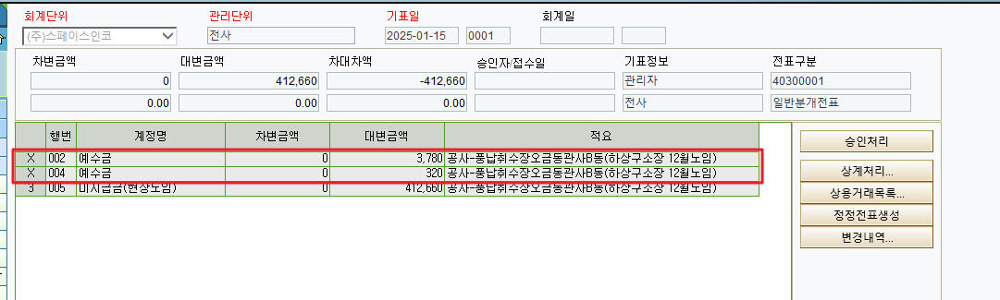
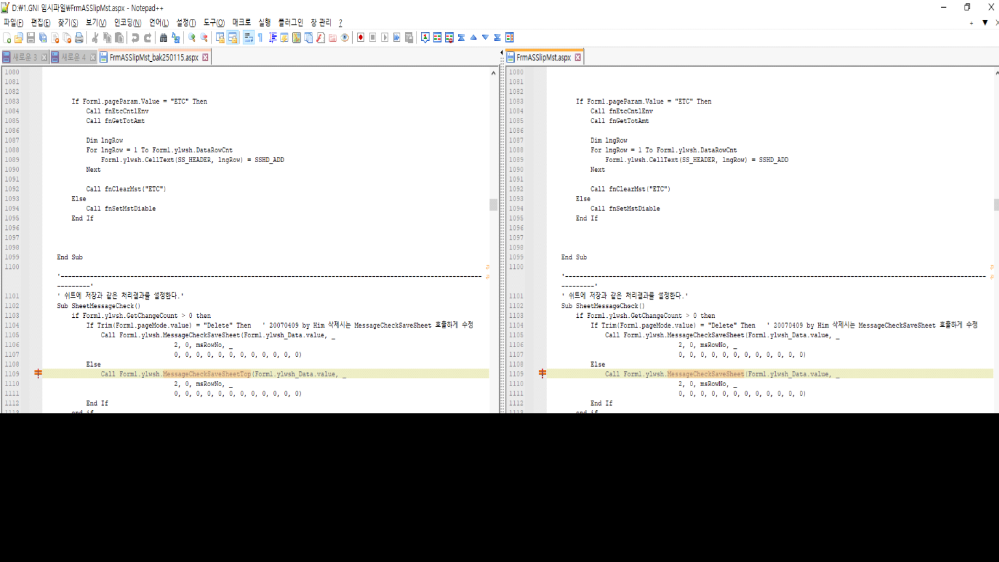

# 25.01.15 스페이스인코 분개전표입력

Call Form1.ylwsh.MessageCheckSaveSheetTop =\> Call Form1.ylwsh.MessageCheckSaveSheet 수정

 

\[분개전표입력\] 화면에서 전표 '복사하여 저장' 후 일부 행을 삭제하는 경우, 삭제된 행이 함께 조회됩니다.

 

'전표 '복사하여 저장' \> 복사된 전표 일부 행 삭제 \> 삭제된 행이 조회됨 \> 화면 조회 시 삭제된 행이 없어짐'

위와 같은 순서로 진행되며 현재 삭제되어도 조회되는 행은 2, 4, 6 등 짝수 행인 것으로 보입니다.

 

삭제된 행이 삭제되지 않은 행과 함께 조회되는 원인 확인 부탁드리며, 삭제된 행은 조회되지 않도록 수정 부탁드립니다.



1\. \[분개전표입력\] 화면에서 기표일 칼럼에 2025-01-09 / 15 입력 후 조회해주시면 됩니다.

2\. 화면 상단 '복사하여 저장' 버튼 눌러주신 후 일자 칼럼에 2025-01-15 입력하여 처리해주시면 됩니다.

3\. 1~4행 선택 후 행삭제 해주시면 됩니다.

삭제 시 아래와 같이 행헤더가 X로 표시되며 삭제된 행이 조회됩니다.

화면 재조회 시에는 삭제된 행이 조회되지 않으며 삭제하지 않은 5행만 조회됩니다.



확인 부탁드립니다. 감사합니다.

 

 

 

