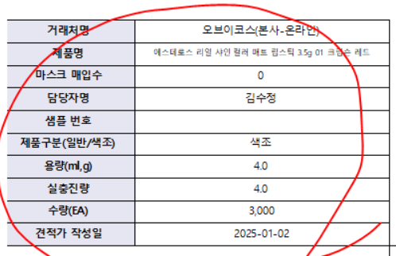
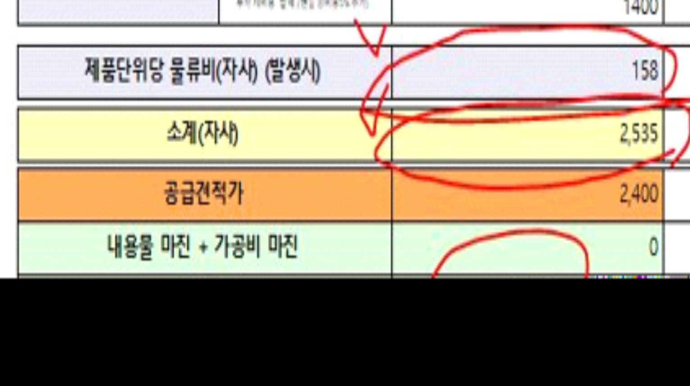

# 25.01.20 그린코스 견적단가산출

안녕하세요 시스웨어 하동호입니다.



견적단가산출_gcos 견적단가표(자사) 출력물에서 



1\. 왼쪽 위를 견적단가산출_gcos 견적단가표(OEM) 출력물과 동일하게 만들어주세요

2\. 제품단위당 물류비(자사) (발생시) 는 견적단가산출_gcos의 제품단위당 물류비(OEM) 이 나오게 해주세요

3\. 소계(자사) 는 원래 제품단위당 물류비(자사)를 계산 된 값이 나왔는데 제품단위당 물류비(OEM) 값으로 계산되도록 변경해주세요

4\. 마진율은 오른쪽 정렬로 변경해주세요



확인부탁드립니다. 감사합니다.

 

출처: \<<https://call.sysware.co.kr/Page/Open/76675/100101/0/18820244>\>

| 자사 | RptWMDPriceCalc_gcos    |
|------|-------------------------|
| OEC  | RptWMDPriceCalcOEM_gcos |