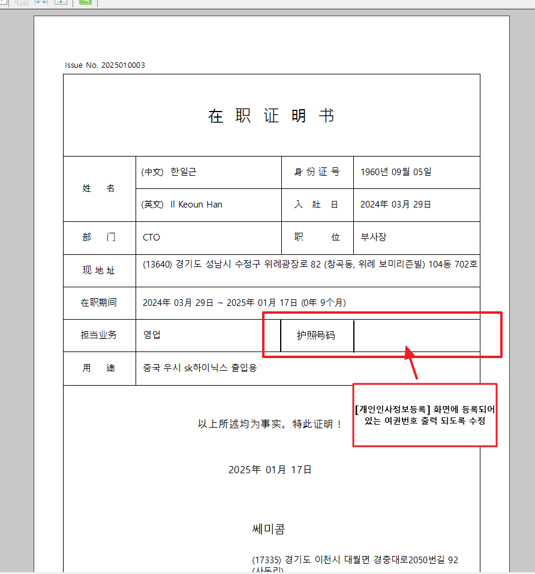

# 25.01.20 쎄미콤 증명서발행/승인

안녕하세요. 운영지원팀 박다은입니다.

\[증명서발행/승인\] 화면에서 재직증명서(RptXHRBasCertificateService) 출력 시 담당업무 칼럼 옆에 여권번호 칼럼 추가 부탁드립니다.

여권번호 값은 \[개인인사정보등록\] 여권/비자정보 탭에 등록되어 있는 값 가져오면 될 것 같습니다.

중국어로 출력 될 때 여권번호 -\> 护照号码로 출력 되게 출력물 수정 해주시면 됩니다. 확인 부탁드립니다. 감사합니다.

 

출처: \<<https://call.sysware.co.kr/Page/Open/76675/100101/0/18820244>\>

RptXHRBasCertificateService.ozr