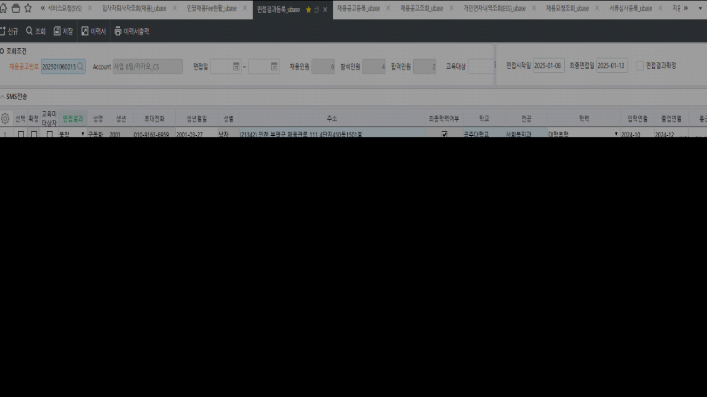

# 25.01.22 유베이스 면접결과등록_ubase

안녕하세요. 운영팀 이다은입니다.

\[서류심사등록_ubase\] 화면에서조회 시 손혜정의 경우 한 건으로 조회 되나, \[면접결과등록_ubase\] 화면에서 조회 시 두 건으로 조회 되고 있습니다.

때문에 저장 시 첨부 이미지와 같이 오류가 발생하고 있어 \[면접결과등록_ubase\] 화면에서 조회 되는 데이터 또한 \[서류심사등록_ubase\] 화면과 동일한 조건으로 조회 되도록 수정 부탁드립니다.

확인 부탁드립니다. 감사합니다.

 

 

출처: \<<https://call.sysware.co.kr/Page/Open/76861/100101/0/18820244>\>