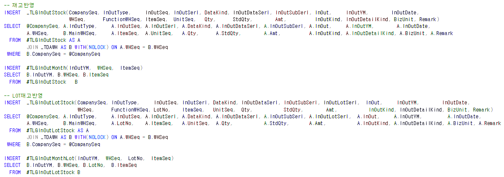
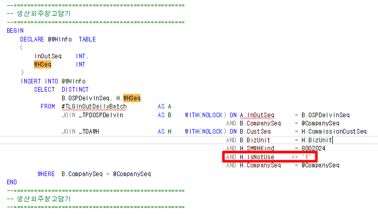

# 25.02.10 외주입고 재고집계 미조회

-- 품목별투입조회

SELECT \* FROM \_TESMCProdFMatInput WHERE MatItemSeq = 4749

SELECT \* FROM \_TESMCProdFMatInput WHERE MatItemSeq = 302130

 

 

SELECT \* FROM \_TLGInOutStock WHERE InOutYM = '202401' AND ItemSeq = 4749 AND InOutType = 150 -- 104 / 14 / 14

UNION

SELECT \* FROM \_TLGInOutStock WHERE InOutYM = '202401' AND ItemSeq = 302130 AND InOutType = 150

 

SELECT \* FROM \_TLGWHStock WHERE StkYM = '202401' AND ItemSeq = 4749

SELECT \* FROM \_TLGWHStock WHERE StkYM = '202401' AND ItemSeq = 302130

 

SELECT \* FROM \_TDASMinor WHERE MajorSeq = 8042 AND MinorValue = 150

 

 

-- 106 / 3 / 3 // 106 / 4 / 4

--=======================================================================

-- 외주입고

--=======================================================================

SELECT M.OSPDelvInDate,E.WhSeq,D.WhSeq, E.OSPDelvInNo,M.\*

FROM \_TPDOSPDelvInItemMat AS M WITH(NOLOCK)

JOIN \_TPDOSPDelvInItem AS D WITH(NOLOCK) ON M.OSPDelvInSeq = D.OSPDelvInSeq

AND M.OSPDelvInSerl = D.OSPDelvInSerl

AND M.CompanySeq = D.CompanySeq

JOIN \_TPDOSPDelvIn AS E WITH(NOLOCK) ON M.OSPDelvInSeq = E.OSPDelvInSeq

AND M.CompanySeq = E.CompanySeq

WHERE LEFT(E.OSPDelvInDate ,6) = '202401'

AND M.ItemSeq = 4749

UNION

SELECT M.OSPDelvInDate,E.WhSeq,D.WhSeq, E.OSPDelvInNo,M.\*

FROM \_TPDOSPDelvInItemMat AS M WITH(NOLOCK)

JOIN \_TPDOSPDelvInItem AS D WITH(NOLOCK) ON M.OSPDelvInSeq = D.OSPDelvInSeq

AND M.OSPDelvInSerl = D.OSPDelvInSerl

AND M.CompanySeq = D.CompanySeq

JOIN \_TPDOSPDelvIn AS E WITH(NOLOCK) ON M.OSPDelvInSeq = E.OSPDelvInSeq

AND M.CompanySeq = E.CompanySeq

WHERE LEFT(E.OSPDelvInDate ,6) = '202401'

AND M.ItemSeq = 302130

--=======================================================================

--=======================================================================

\_tdawh

--SELECT \* FROM \_TDAWH WHERE WHSeq IN (13,14,42,54)

--42 14

--54 13

외주입고의 창고 (\_TPDOSPDelvIn - WHSeq) 가 사용안함 되어있어,

재집계 안된 것으로 확인

 

재집계

1.  \_SWLGReInOutStockSum

2.  \_SWLGReInOutStock (창고 NULL로 인해 집계 미반영 =\> NULL인 이유 = 4번)

    1.  

3.  \_SWLGReInOutDailyForOSPDelvIn -- (외주입고)

4.  \_SWLGInOutDailyForOSPDelvIn

    1.  외주입고창고(+)

    2.  사업단위입고대기창고(-)

    3.  생산외주창고(-)

        1.  , (SELECT TOP 1 WHSeq FROM @WHInfo WHERE InOutSeq = A.InOutSeq) AS WHSeq

>  
>
>  

