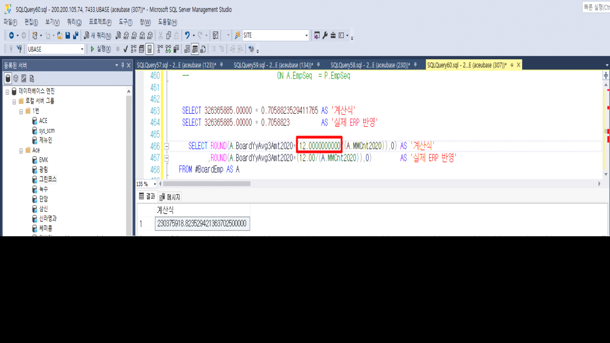

# 25.02.19 유베이스 퇴직금처리

퇴직금처리 화면 권상철 00000055 임원퇴직금처리 시,

 

\<퇴직전3년간의연평균급여(2020.01.01 이후분)\> 칼럼에 금액이 

 

307099262\*(12/17) 산식으로 계산 되어  216,775,950원이 산출 되어야 하나 현재 216,775,933원이 산출 되었습니다.

 

계산 로직이 사이트인지 확인 부탁드리며 사이트인 경우 정상적으로 계산 될 수 있게 수정 부탁드립니다.

 

확인 부탁드립니다. 감사합니다.

 

 

안녕하세요. 개발팀 박성재 입니다.

 

\[퇴직금처리\] 화면 퇴직금 계산 시 표준 SP 동작하고 있습니다.

(SP :\_SXPRRetWRetAmtBoardMLimitCr_2020)



퇴직전3년간의연평균급여 \* (12 / 17) 계산 식에 대해

'12 / 17' 값에 대해 

230375918\.823529421363702500000 값이 아닌

230375901\.545335500000 값이 적용되어 계산식과 다른 결과값 저장된 것으로 확인하였습니다.

12.00 에 대해 소수점 0 자리수 증가하여 계산시 정상적으로 값 조회됩니다.



퇴직금 계산 SP 흐름

\_SXPRRetWRetAmtProc =\> \_SXPRRetWRetAmtCalc =\> \_SXPRRetWRetAmtBoardMLimitCr_2020

 

확인 부탁 드립니다.

 

감사합니다.

 

출처: \<<https://call.sysware.co.kr/Page/Open/78544/100101/0/18820244>\>