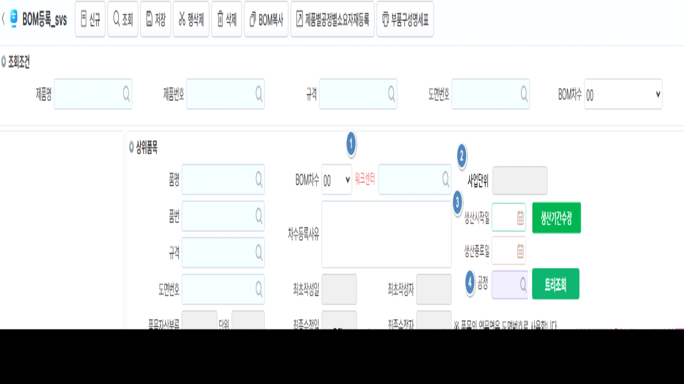

# 

**화면 수정 사유**: 워크센터 항목 추가해서 BOM생성 시 제품별공정별소요자재까지 모두 한번에 생성하는 로직 추가

1\. 워크센터 추가 : 공정 위치에 반영

2\. 사업단위: 워크센터 선택 시 사업단위 조회 (DIS;)

  - 비슷한 명칭의 워크센터를 사용중으로 구분 가능하도록 하기 위함

3\. 생산시작일-생산종료일, 생신기간수정버튼 : 세동 개발 참고

4\. 공정 코드도움 위치 변경

  - 셀바스헬스케어는 공정을 정보성으로만 사용하고 있어 위치 변경



\<이미지 참고\>

