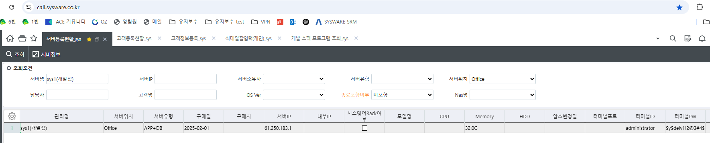

# 암호 / 비밀번호

1번 서버

\[서버등록현황_sys\]

서버명 : sys1(개발섭)

서버위치 : Office

 

비번 (25.03.12) : SySdelv1!2@3#4\$

SySdelv1!2@3#4\$

 

58번 서버

1.  yjkwon - 1003

2.  tllee - tllee

> ybheo - 0903

 

 

 

7번

Administrator

Sysw@re7

 

 

헬프유 (HelpU)

 

sysware1~7

1234

 

367.co.kr

 

 

 

 

 

MS

Id : <shhan@sysware.co.kr>

Pw : sysware01

(개인 아이디로 로그인)

 

Visiual studio 연결 시

Administrator

Sysw@re

 

관리자말고

 

sjpark

Sjpark209#

 

오른쪽에서

솔루션탐색기 or 보류중인 변경내용

 

매핑안되어 있으면 매핑

 

 

 

microsoft (25.03.04)

sjpark@sysware.co.kr

qkrtjdwo1!