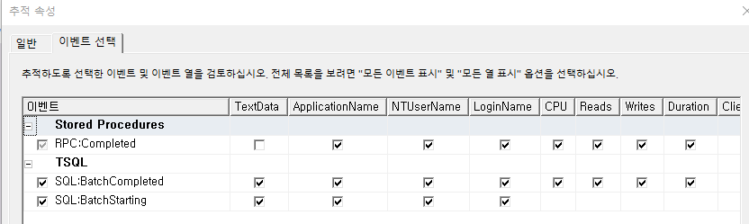
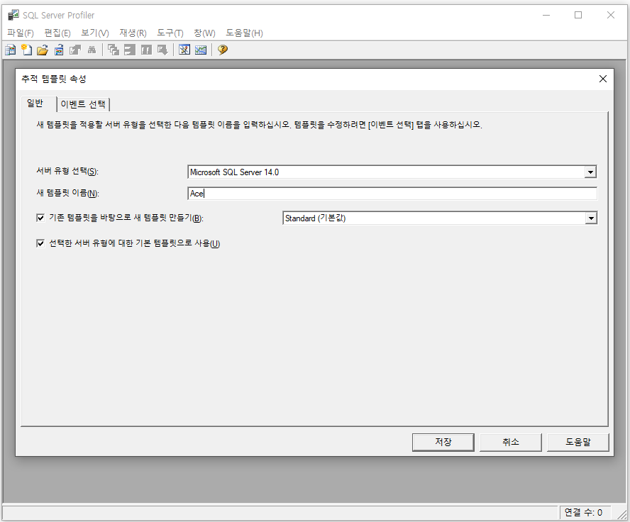
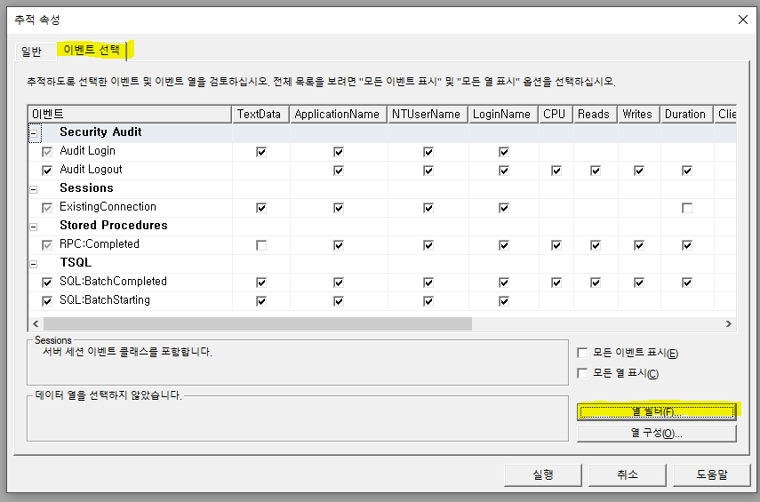

# 프로파일러

Ace

1.  ApplicaitonName

    1.  %sjpark%

    2.  %master%

    3.  %ylw%

2.  TextData

> \* 유사
>
> %exec % (맨 끝에 공백)
>
> %OSCACodeHelpQuery %
>
> %\_SCACodeHelpComboQuery %
>
>  
>
> \* 유사하지 않음
>
> 1\. %sp_reset_connection%
>
> 2\. %design%
>
> 3\. %\_SCAServiceTimeLogSave%
>
> 4, %\_SCADebugLogParamSave%
>
> 5\. %\_SCAProgramExecuteTimeWrite%
>
>  
>
>  

Genuine

1.  Standard

2.  컴퓨터이름

    1.  탐색기 - 내 pc - 우클릭, 속성 - 장치이름

> +. 원격으로 들어갈 시 고객사꺼 사용

 

G&I

1.  템플릿 사용 : Tuning

<!-- -->

2.  TextData =\> 유사 : %SP명%

Ace - 프로파일러

1번 서버 – 61.250.183.1.14233

 

 

 

 

\*\*\*\*\* 프로파일러 \*\*\*\*\*\*

테스트 시 모든 컬럼을 작성 후 테스트

DECLARE\~~ 참조

 

+. 조회는 입력할게 없어서 output만 있어도 된다

저장은 입력한 값을 알아야하기 때문에 input도 있어야함, 안 뿌리면 공백이기 때문에 output도 필요

 

intput된걸 그대로 output에도 저장 (orderseq는 아직 0)

 

디버깅할 때 sp이름 뒤에 \_test를 붙여서 임의로 하나 생성

 

status 값이 매우 중요 – 0이어야 쭉 계속 내려감

----------------------------------------------------