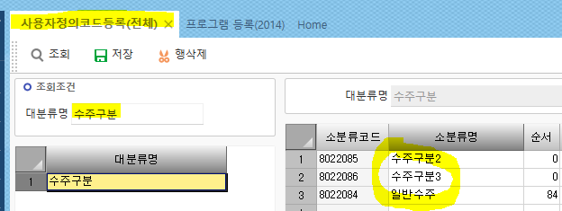
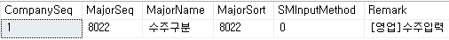
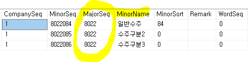
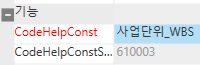

# 사용자정의코드

\<\<사용자정의, 시스템제공 코드.hwp\>\>

 

> 프로그램등록
>
> 1\. 사용자정의코드분류등록(영림원AS) \_TDAUMajor
>
> 2\. 시스템제공코드분류값등록 \_TDASMajor
>
>  
>
> \* 사용자 정의코드 (\_TDAUMinor)
>
> 쓰는 이유 : 사용자를 위해 만든 코드를 정리한 곳
>
> 
>
>  
>
>  
>
> ex.
>
> cs - 사용자정의코드등록(전체)
>
> 대분류명 - 수주구분
>
>  
>
> \_TDAUMajor - 대분류 코드 (ex.수주구분)
>
> \_TDAUMinor - 소분류 코드
>
> ==\> orderseq처럼 majorseq로 연결되어있다
>
> 
>
>  
>
> 
>
>  
>
>  
>
> 
>
>  
>
> 
>
>  
>
> --------------
>
>  
>
>  
>
> 소분류는 알지만 대분류를 모른다
>
> =\> 시스템에 있다고 해도 그냥 사용자정의코드에 추가해도된다
>
>  
>
> S인지 U인지 모를 때
>
> 19998 – S
>
> 19999 - U
>
> 
>
> =\> 19998, 19999 가 아닌건 ‘코드도움’ 방식이다
>
>  
>
> 코드헬프 방식은 - 1. 사용자정의코드, 2.코드도움 2가지 방식이 있다
>
> 2방식은 사원처럼 계속 증가해서 일일히 추가해줄 수 없는 경우에 사용한다
>
> or 복잡한 경우