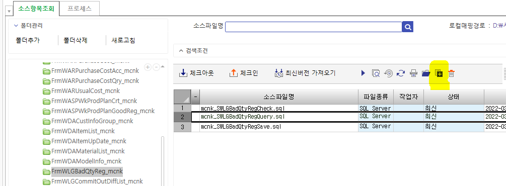
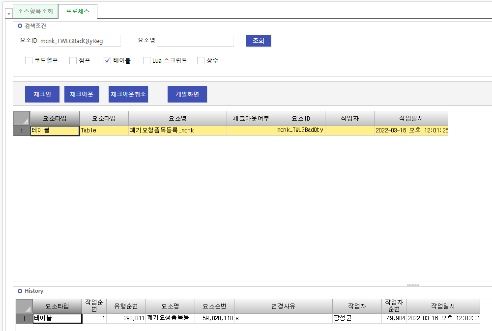
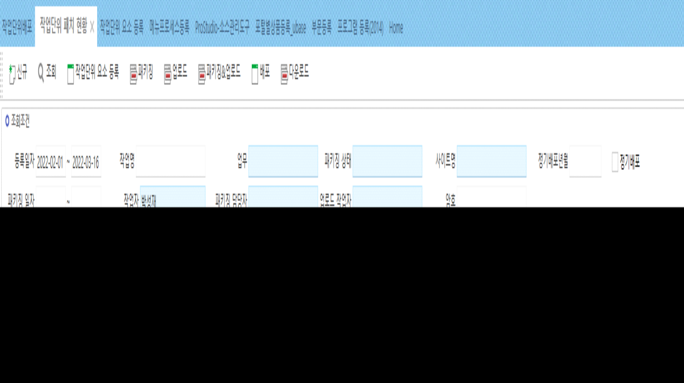
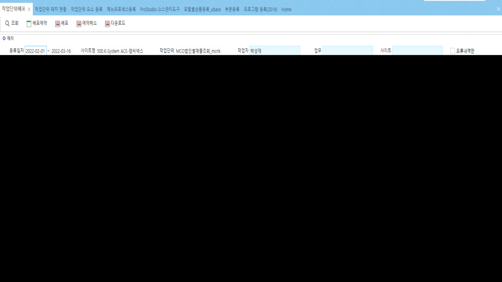

# 패치

> 1\. ProStudio-소스관리도구
>
> 1-1.SP : 소스항목조회
>
> \* 신규일 경우
>
> 프로그램ID명으로 폴더 생성
>
> pc 폴더에 sp파일 넣기
>
> 항목추가 눌러서 추가
>
> 체크인
>
> 
>
> 1-2.테이블 : 프로세스
>
> \* 신규일 경우
>
> 요소ID에 테이블명 검색 (하단은 테이블에만 체크 표시)
>
> 체크
>
> 
>
> --------------------------------------------------------------
>
>  
>
> 2\. 작업단위패치
>
> 2-1. 작업단위 요소 등록
>
> 
>
> \- 요소 ID : 프로그램 ID =\> 하위품목조회
>
> \- 신규 및 수정한 요소 선택 =\> ‘\<’ 눌러서 왼쪽으로 이동

- 상단 작성

> (차수 증가를 통해 누적 수정 가능)
>
>  
>
>  
>
> 2-2. 작업단위 패치 현황
>
> 
>
> 조회 – 패키징&업로드 - 배포
>
>  
>
>  
>
> 2-3. 작업단위배포
>
> 
>
> 선택 체크 =\> 배포 =\> 작업단위의 ‘1’ 누르면서 새로고침
>
>  
>
>  
>
>  
>
>