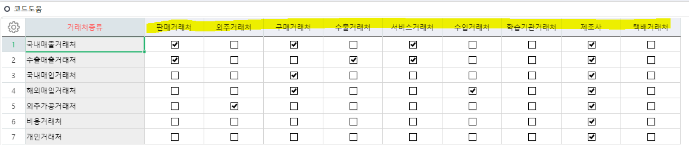
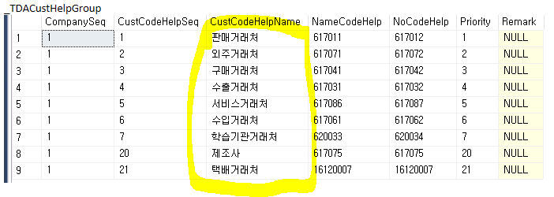

# 추가정보정의 / 코드도움설정

거래처종류등록 및 코드도움설정

 

 

사용자정의코드 패치

(시군, 시면)

 

=\> 1번에서 테스트 하기전에 데이터 없는 상태로 실서버에 먼저 패치

그 후에 TEST 소분류 넣어서 TEST

===========================================================================

추가정보정의 테이블 INSERT

INSERT INTO \_TCOMUserDefine

SELECT '1','\_TDACust','2004','1000004','시면','0','19999','2140133','1027003','','4','0','','0','27292','2022-06-21 13:42:09.603','0','0' UNION

SELECT '1','\_TDACust','2004','1000005','OB팀','0','0','','1027006','','5','0','','0','27292','2022-06-21 13:42:09.603','0','0' UNION

SELECT '1','\_TDACust','2004','1000006','스타파트너','0','0','','1027006','','6','0','','0','27292','2022-06-21 13:42:09.603','0','0' UNION

SELECT '1','\_TDACust','2004','1000007','수요자코드','0','0','','1027006','','7','0','','0','27292','2022-06-21 13:42:09.603','0','0' UNION

SELECT '1','\_TDACust','2004','1000008','환코드','0','0','','1027001','','8','0','','0','27292','2022-06-21 13:42:09.603','0','0'

 

 

=\> 실서버 ERP 추가정보정의에서 해도 되지만 그러면 Serl이 안 맞기 때문에

직접 DB에서 INSERT 해주는 방식으로 해야한다

===========================================================================

\_TDACustHelpGroup

===========================================================================

 

 

===========================================================================

SELECT \* FROM \_TDACustClass WHERE UMajorCustClass = 8001 -- 기타정보

 

select \* FROM \_TCOMUserdefine where tablename = '\_TDACust' -- 모든 추가정보정의 테이블

 

select \* FROM \_TDACustUserDefine WHERE MngSerl = 8001 -- 거래처 추가정보정의 테이블

 

SELECT \*FROM \_TCOMUserDefine

WHERE TableName = '\_tdaumAJOR' AND DefineUnitSeq = 8004