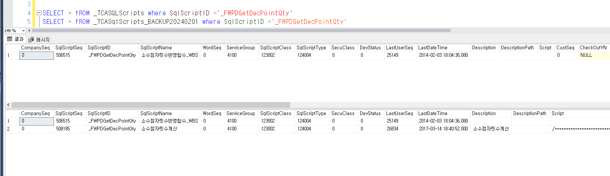

# 패치 오류 PK_TCASQLScriptsDepends

\_TCASqlScripts 테이블에 \_FWPDGetDecPointQty 명칭을 가진 건이 2개 존재 =\> 1개 삭제

 

 

SELECT \* fROM \_TCASQLScripts where SqlScriptID ='\_FWPDGetDecPointQty'

SELECT \* fROM \_TCASqlScripts_BACKUP20240201 where SqlScriptID ='\_FWPDGetDecPointQty'

 

PRIMARY KEY 제약 조건 'PK_TCASQLScriptsDepends'을(를) 위반했습니다. 개체 'dbo.\_TCASQLScriptsDepends'에 중복 키를 삽입할 수 없습니다. 중복 키 값은 (70320276, \_FWPDGetDecPointQty)입니다.

 

 

