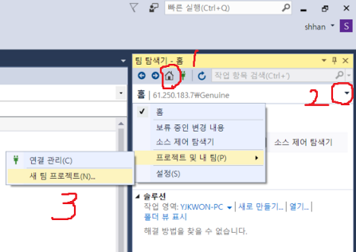

# 소스세이프 사이트 추가

소스세이프 탐색기가 열린 상태에서

상단 툴바 중 맨 오른쪽 정도에 있는 팀 탐색기 아이콘 클릭

팀 탐색기 - 상단 코드 아이콘 클릭 - 연결관리 - 프로젝트에 연결 - TFS 서버 추가(명칭 다른 것일 수도 있음)

\- 서버 URL에 <http://61.250.183.7:8080/tfs/> 이런식으로 추가하면 됨(또는 그냥 61.250.183.7 로 입력해도 됨.)

 

권한때문에 막힐 경우

 

7번 원격 접속 \> 시작-제어판-모든 계정-사용자계정만들기 로 계정 추가한 뒤,

비번은 Ghpark209# 과 같이 209#을 붙여서 만들어준다.(비번 힌트도 209# 으로 넣기)

 

컴퓨터관리 라는 창이 있다. 시작\>검색란 에 넣어서 창을 열어보자.

해당 창 좌측에서.. 로컬사용자그룹\>사용자\>여기에 있는 다른 사용자들에 대한 설정값을 동일하게 만들어준다.

 

방화벽 때문인지 확인 필요

 

 

 

팀 탐색기 어딨는지 잘 모를 경우

상단 메뉴 중 보기 - 팀 탐색기

소스 제어 탐색기가 안 보일 경우

상단 메뉴 중 보기 - 다른 창 - 소스 제어 탐색기

 

 

 

마이크로아이디 비번

ID : shhan@sysware.co.kr

PW : sysware01

 

61.250.183.7로 연결하고 로그인

ghpark

Ghpark209#

