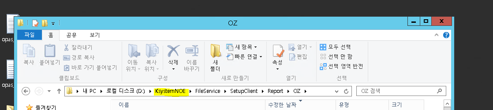

# 1번 출력물 위치

[\\61.250.183.1\d\KsystemAce\ACE_Kstudio_APP\FileService\SetupClient\Report\OZ](file://61.250.183.1/d/KsystemAce/ACE_Kstudio_APP/FileService/SetupClient/Report/OZ)

 

C:\ksystem\oz70\repository_files

 

Administrator

sysdelv1!@

 

 

Genuine

D:\Ksystem\FileService\SetupClient\Report\OZ

 

D:\Ksystem\FileService\SetupClient\Report\RD

 

밑에 처럼 한 서버에 여러 사이트인 경우 Ksystem =\> Ksystem사이트명 일 수도 있다

 

 

 

D:\KsystemDev\FileService\SetupClient\Report\OZ x

 

 

 

 

 

Ace

C:\ksystem\oz70\repository_files

 

 

 

 

 

D:\KsystemDEV_wk_CS\FileService\SetupClient\Report\OZ