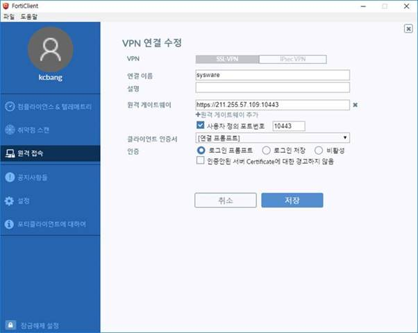

# 사내 vpn 접속

> 사내 VPN이 다시 구성 되어 접속 방법 알려드립니다.
>
>  

1.  첨부해 드리는 클라이언트 설치

2.  그림과 같이 연결 정보를 추가합니다.

>  
>
> 
>
>  
>
> 원격게이트워이 <https://211.255.57.109>
>
> 포트번호 10443 
>
>  

3.  아이디 및 암호

> 1 : sysware01 / sysware01  ~ sysware10 / sysware10
>
>  
>
> 추후 소스세이프도 외부 오픈 안할예정입니다. 소스세이프 사용시 VPN접속후 사용하세요.
>
>  
>
> 소스세이프는 아직 복구중입니다.
>
>  
>
> 수고하세요