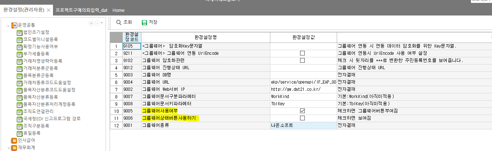

# 그룹웨어

파라미터 예시

 

-- 에이스

EXEC \_SWCOMGroupWarePrint

@CompanySeq = 1 --

,@LanguageSeq = 1 --

,@UserSeq = 1 --

,@PgmSeq = 501568 -- 프로그램코드

,@WorkKind = 'ApprovalReq' -- 결재문서번호 (구매품의)

,@TblKey = 286 -- 내부코드

,@SiteInit = 'das' -- 사이트이니셜

 

-- 제뉴인

EXEC \_SCOMGroupWarePrint

@CompanySeq = 1 -- 법인명

,@LanguageSeq = 1 -- 언어

,@UserSeq = 1 -- 로그인사용자

,@PgmSeq = 12820214 -- 프로그램코드

,@WorkKind = 'rot_TACCarDriving' -- 결재문서번호 (구매품의)

,@TblKey = 6 -- 내부코드

,@SiteInit = 'rot' -- 사이트이니셜

 

 

 

 

 

Ace : \_SWCOMGroupWarePrint 1 , 1 , 1 , 63730042 , 'WkWorkBatch_sdng' , 6 , 'sdng'

 

제뉴인 : \_SCOMGroupWarePrint 1 , 1 , 1 , 6820004 , 'POReq' , 373, 'dat'

 

GNI : exec SDAGroupWarePrint

@pWorkKind='frmTMEtcOutReq', -- 기타출고요청

@pTblKey='01202304120002',

@pLanguageID='0'

 

 

단암 :

begin tran

DECLARE @Status INT = 0,

@Results NVARCHAR(250) = ''

SELECT @Status = 0, @Results = ''

EXEC danam_SPRWkEmpOTHoliAppAfterCrt 1, 'E', 1, 1, '2313', @Status OUTPUT, @Results OUTPUT

select \* from \_TPRWkEmpDd where EMpSeq = 151 and Wkdate like '20240201%'

select \* from \_TPRWkEtcMng where EMpSeq = 151

rollback tran

 

 

 

 

 

환경설정(관리자용) - 그룹웨어 - 전자결재문서설정

 

키 값이 중요 - 결재문서번호 / (하단시트 - Seq컨트롤명)

대부분 출력 SP에 사이트 sp 넣어서 해줌

 

 

신규로 작성할 때 SP 마지막에 GWQuery 넣기 ( ex. ets_SPJTBOMApprovalReqGWQuery )

 

 

\_SCOMGroupWarePrint =\> 제일 처음 수정하는 sp (사이트 내용 반영)

\_SCOMGroupWareStatus =\> 후처리 sp 타게 할 수 있음

\_SCOMGroupWareStart =\> 사이트 sp 타게 할 수 있음 (분기 나눠져있기 때문에 @WorkKind, @TblKey, @WorkingTag 잘봐야함

 

 

 

 

 

환경설정코드 : 9006 =\> 그룹웨어상태버튼

 

