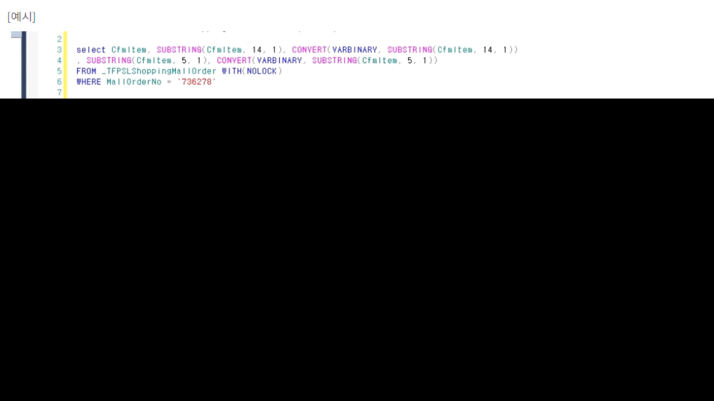

# Unexpected token in JSON at position 71908

\[오류예시\]

Unexpected token in JSON at position 71908 오류가 발생하고 있습니다.

해당 오류는 조회하는 데이터에 JSON에서 허용하지 않는 특수문자를 포함하고 있어

JSON 변환 시 발생하는 오류입니다.

이와 같은 오류 발생 시 처리방법입니다.

 

출처: \<<https://kdc.ksystem.co.kr/WebDev>\>

 

 

--실행문 예시

select CfmItem, SUBSTRING(CfmItem, 14, 1), CONVERT(VARBINARY, SUBSTRING(CfmItem, 14, 1))

, SUBSTRING(CfmItem, 5, 1), CONVERT(VARBINARY, SUBSTRING(CfmItem, 5, 1))

FROM \_TFPSLShoppingMallOrder WITH(NOLOCK)

WHERE MallOrderNo = '736278'

 

select CfmItem, SUBSTRING(CfmItem, 14, 1), CONVERT(VARBINARY, SUBSTRING(CfmItem, 14, 1))

, SUBSTRING(CfmItem, 5, 1), CONVERT(VARBINARY, SUBSTRING(CfmItem, 5, 1))

FROM \_TFPSLShoppingMallOrder WITH(NOLOCK)

WHERE MallOrderNo = '736279'

 

 

 

 

 

\[해결방법\]

1\) 조회 시 프로파일러로 실행문을 잡아 테이블 데이터에 문제가 되는 특수문자가 있다면 해당 문자를 제거해줍니다.

2\) 위 방법으로 원인을 파악하기 어려운 경우, 다음 실행문을 활용하여 문제가 되는 문자를 찾으실 수 있습니다.

SQL복사

--실행문 예시selectCfmItem, SUBSTRING(CfmItem, 14, 1), CONVERT(VARBINARY, SUBSTRING(CfmItem, 14, 1))\
, SUBSTRING(CfmItem, 5, 1), CONVERT(VARBINARY, SUBSTRING(CfmItem, 5, 1))\
FROM_TFPSLShoppingMallOrder WITH(NOLOCK)\
WHEREMallOrderNo = '736278'selectCfmItem, SUBSTRING(CfmItem, 14, 1), CONVERT(VARBINARY, SUBSTRING(CfmItem, 14, 1))\
, SUBSTRING(CfmItem, 5, 1), CONVERT(VARBINARY, SUBSTRING(CfmItem, 5, 1))\
FROM_TFPSLShoppingMallOrder WITH(NOLOCK)\
WHEREMallOrderNo = '736279'

 

 

--실행문 예시

select CfmItem, SUBSTRING(CfmItem, 14, 1), CONVERT(VARBINARY, SUBSTRING(CfmItem, 14, 1))

, SUBSTRING(CfmItem, 5, 1), CONVERT(VARBINARY, SUBSTRING(CfmItem, 5, 1))

FROM \_TFPSLShoppingMallOrder WITH(NOLOCK)

WHERE MallOrderNo = '736278'

 

select CfmItem, SUBSTRING(CfmItem, 14, 1), CONVERT(VARBINARY, SUBSTRING(CfmItem, 14, 1))

, SUBSTRING(CfmItem, 5, 1), CONVERT(VARBINARY, SUBSTRING(CfmItem, 5, 1))

FROM \_TFPSLShoppingMallOrder WITH(NOLOCK)

WHERE MallOrderNo = '736279'

 

 

출처: \<<https://kdc.ksystem.co.kr/WebDev>\>

