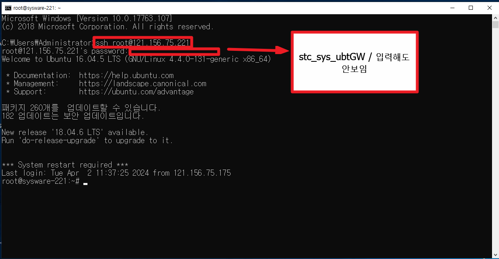
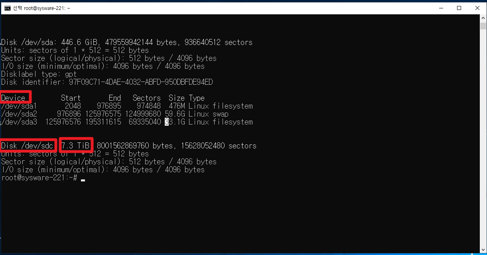
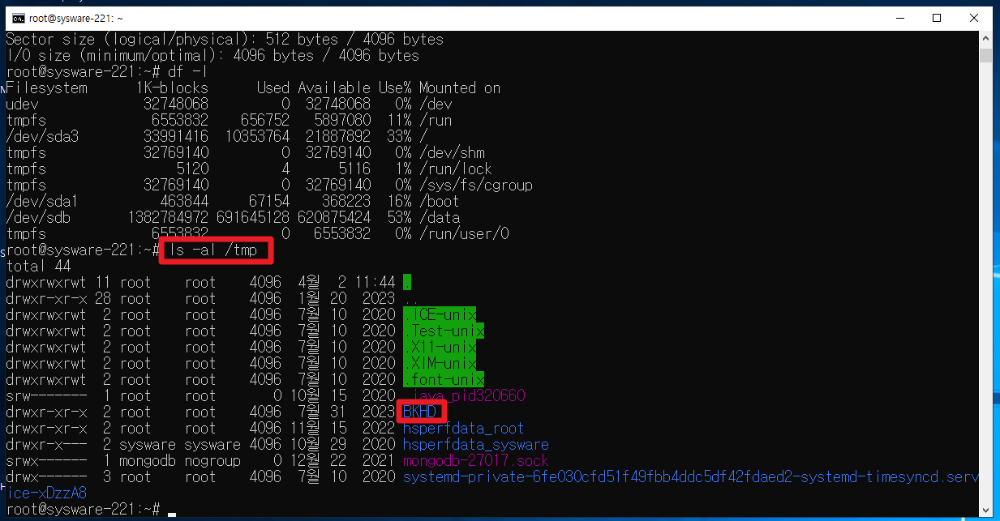
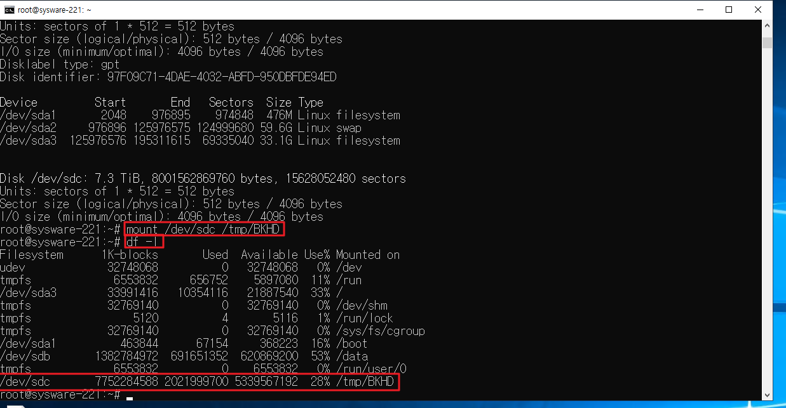
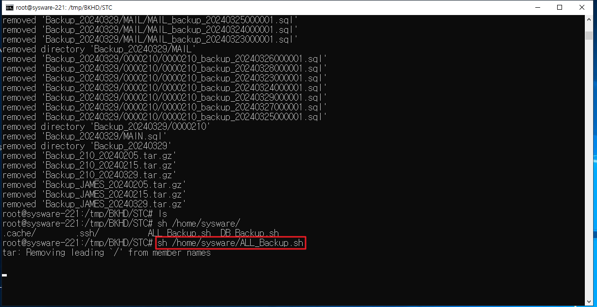

# 그룹웨어 백업

--\*\*\*\*\*\*\*\*\*\*\*\*\*\*\*\*\*\*\*\*\*\*\*\*\*\*\*\*\*\*\*\*\*\*\*\*\*

-- 그룹웨어 백업

--\*\*\*\*\*\*\*\*\*\*\*\*\*\*\*\*\*\*\*\*\*\*\*\*\*\*\*\*\*\*\*\*\*\*\*\*\*

121.156.75.175

 

\* 그룹웨어 백업

나스 백업과 다름 / 그룹웨어는 리눅스를 사용

 

서버 자체에서 곧바로 외장하드로 백업

애초에 윈도우가 취약하기 때문에 나스를 사용하는 것

 

 

 

백업하는 그룹웨어 서버

1\. 세스텍

2\. 로봇앤드디자인

 

ssh 라는 프로토콜 사용 (원격 접속하는 하나의 방법)

ssh 계정명@IP

ssh : 원격 접속 프로토콜

 

\*세스텍

ssh root@121.156.75.221

stc_sys_ubtGW

계정명 : 서버 접속하는 ID ( root )

IP : 서버 IP 주소 ( 121.156.75.221 )

비밀번호 (stc_sys_ubtGW)

 

 

\*로봇앤드디자인

계정명 : 서버 접속하는 ID ( )

IP : 서버 IP 주소 ( )

 

 

 

 

 

 

접속하는 곳 : 세스텍 이라는 곳의 그룹웨어 서버

서버IP : 221 검색하면 =\> 관리명: 세스텍 나옴 여기에 아이디 비번있음

 

 

\* 마운트 =\> 연결

물리적으로는 하드가 연결되어있지만, 우리가 볼 수 있도록 소프트웨어 적으로 연결하는 작업이 마운트

=\> 꽂은 외장하드에 대한 경로지정

 

로그인 후

fdisk : 마운트 된 디스크 리스트

명령어 : fdisk -l (명령어 쓸 때는 - 써야함)

 

 

 

 

 

dev/sdb

dev/sda

dev/sdc 총 3가지가 인식 됌

여기서 8테라 짜리 (7.3) 용량을 보고 뭔지 알 수 있다.

\+ Disk 로 되어있는거 확인 (Device 아님)

ex. Disk /dev/sdc : 7.3 TiB -\> 이름은 계속 바뀔 수 있기 때문에 용량으로 확인

 

 

 

df -l 연결된거 보기 =\> sdc가 없음

Filesystemn / Mounted on

파일디스크 실제 위치

 

------------------------------------------------

마운트 경로 : /tmp/BKHD 에 마운트를 해야함

 

한번 씩이 경로가 사라짐 =\> 있는지 먼저 확인해야함

=\> 확인 명령어 : ls -al /tmp

(ls =\> 폴더에 뭐있는지 보는 명령어)

(al =\> a = all (전체) l(자세히))

(tmp =\> 폴더경로 이름)

=\> BKHD 확인 (마운트 경로 이름)

 

 

 

 

 

\* BKHD가 없는 경우 생성해야함

mkdir 경로

mkdir /tmp/BKHD

 

삭제 : rmdir /tmp/BKHD2

 

 

--------------------------------------------

마운트 명령어 : mount 출발지(디스크) 경로(어디로할지)

mount /dev/sdc /tmp/BKHD

 

mount (dev/sdc) \<-\> (tmp/BKHD) 이 두개의 폴더를 미러링하겠다

 

 

 

다시 df -l 눌렀을 때 BKHD를 볼 수 있다.

 

 

 

cd /tmp

ls =\> 리스트 보기

cd BKHD

ls =\>

EMK RND STC =\> 파란색 = 폴더이름

 

cd STC/

ls

파란색 =\> 폴더

빨간색 =\> 압축파일 (tar.gz로 백업된 압축파일)

 

 

기존 파일 삭제 명령어 (파일 하나만 있어도 되기 때문에 기존에 있던 것들은 다 삭제 해도 된다)

rm -rvf \*202402\*

-------------------------------------------------------------------------------------------------

sh(쉘)파일 =\> 외장하드로 넣기위한 파일을 만들도록 해주는 파일

 

백업 스케줄러 명령어

sh /home/sysware/ALL_Backup.sh

 

탭 : 자동완성 ( / , 파일이름 일부만 쳐도 완성

 

 

 

 

해당 폴더 용량 확인 (0 이면 안된거니까)

du -sh /tmp/BKHDls -al폴더경로(STC)/\*

 

 

 

 

 

df -l

ls -al /tml/BKHD/STC/

du -sh / tmp/BKHD/STC/\*

umount -lf /dev/sdc

 

 

 

 

\*/

마운트 해제

umount - lf /dev/sdb

 

 

 

1\. 관리자권한으로 cmd창 실행

2\. 로그인 \> 세스텍기준ID : ssh root@121.156.75.221 / PW : stc_sys_ubtGW

로봇앤드기준ID : ssh root@121.156.75.169 / PW : )(dnjf23dlf(09월23일)

3\. fdisk -l \> 드라이브 연결확인 \> 연결된 드라이브가 어디인지 확인함(8테라 내외) (연결 안되어있으면 안보임)

4\. cd /tmp \> ls 로 폴더 안 확인 \> BKHD가 없으면 mkdir BKHD

5\. mount /dev/sdc /\*드라이브경로\*/ /tmp/BKHD /\*백업경로\*/

6\. cd BKHD \> df -l 마운트 연결 확인ls

7\. cd STC \> du -sh \>\> 용량보기

8\. cat /home/sysware/ALL_backup.sh -- 컨트롤 C하고 탭 , 수시로 엔터눌러 꺼지지 않게함

9\. cd /tmp/BKHD/STC/ \> ls -al -ls -a- 백업잘됐는지 확인

10\. rm -rvf \*삭제할텍스트\* --이전 백업데이터 삭제 \* \*안의 텍스트가 포함된 이름 전체

11\. 백업보고서 작성용 실행문 \> df -h -- 마운트확인

\> ls -al /tmp/BKHD/stc/ -- 폴더안 확인

\> du - sh /tmp/BKHD/STC/\* \*/

\> umount -lf /dev/sdc -- 마운트 종료