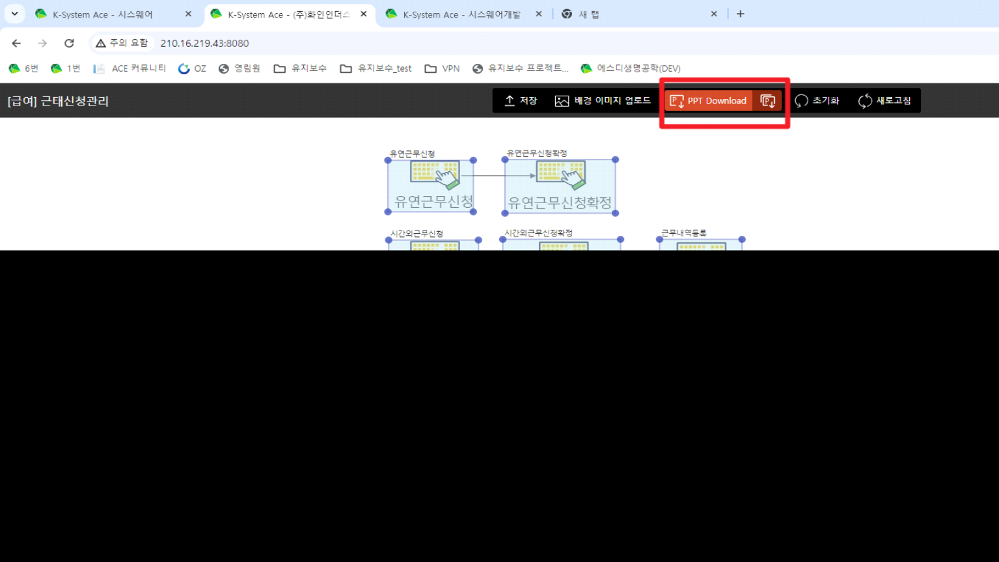
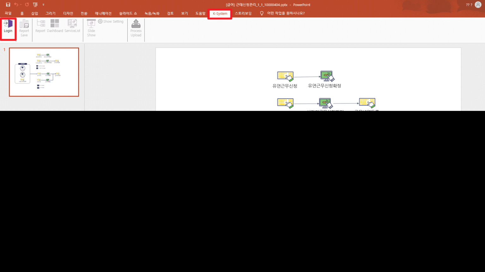
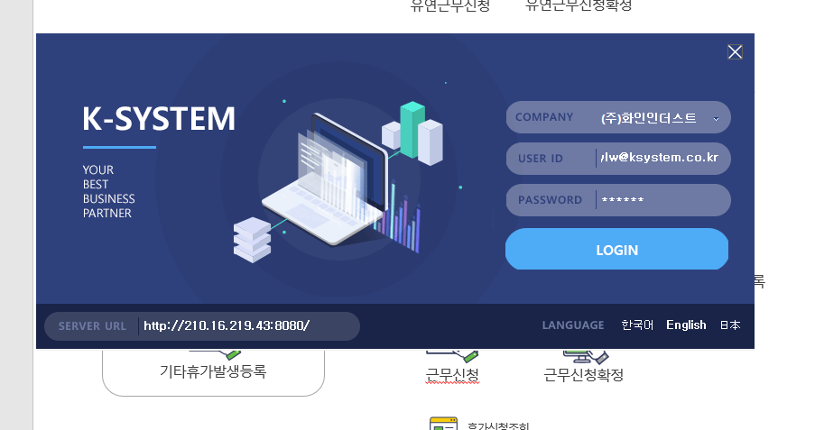

# 프로세스맵 복사 생성

1.  설치파일 다운로드

> \<\<Setup.zip\>\>

 

 

 

2.  PPT 다운로드

 

 

3.  K-System - Login (편집 사용 안되어있으면 설정)

 

 

 

4.  좌측 하단 : ERP 경로 입력 (http:// 포함)

> ERP 아이디 입력
>
> 비밀번호는 아무렇게 입력해도 가능하다

 

5.  신규 프로세스 생성

>  
>
>  

6.  PPT 파일에 해당 키값을 신규 프로세스의 키 값으로 설정