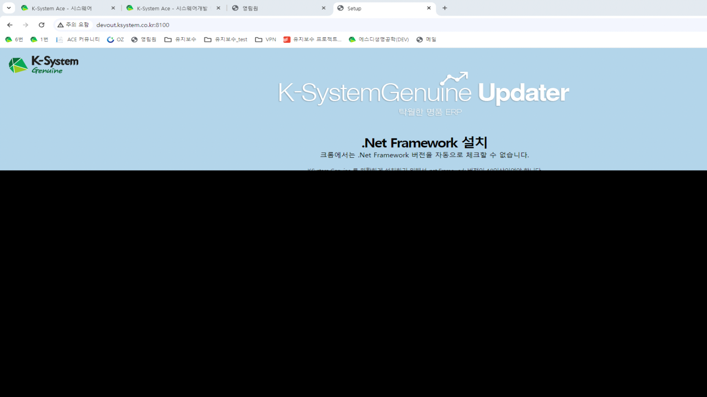
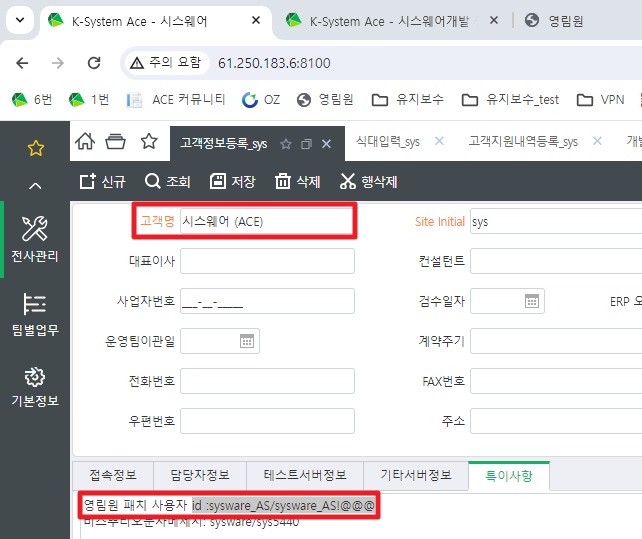
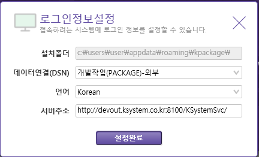
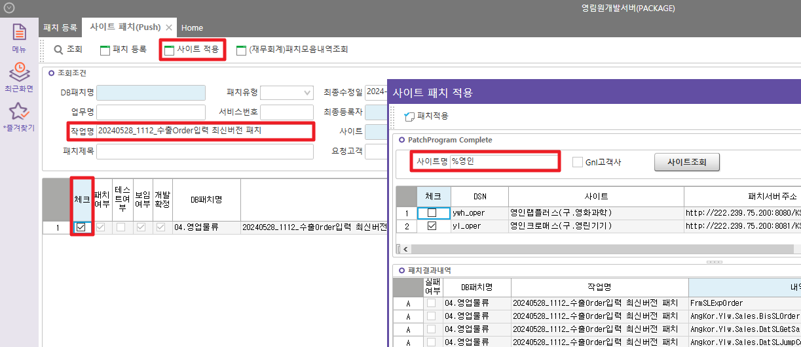

# 영림원 패치 / 영림원 최신 패치 적용 / 영림원 개발서버

1.  cs 설치 주소

> <http://devout.ksystem.co.kr:8100/>
>
> 

 

2.  아이디, 비밀번호 : id :sysware_AS/sysware_AS!@@@

> 
>
>  
>
> 
>
>  
>
>  

3.  사이트 패치(Push) 에서 해당 작업명 체크 후 사이트 적용

> 
>
>