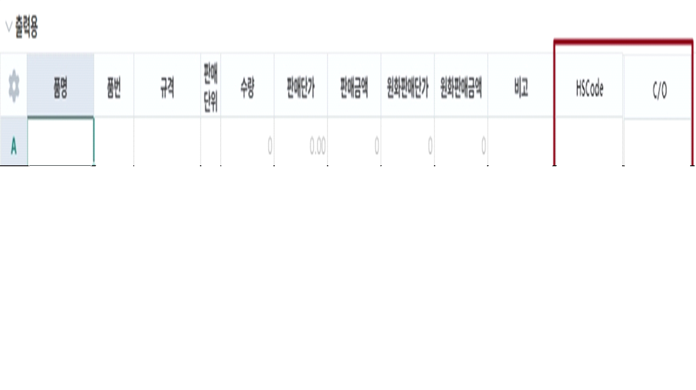

# 25.12.24 수출Order입력

- 수출정보 탭에 Ship to, ADDITIONAL COMMENTS, Bank Information 멀티텍스트 NVARCHAR(500) 추가 요청합니다. 수출기본정보가져오기 기능에도 반영해주세요.

\- Shipper, Consignee, Notify 항목 NVARCHAR(500) 으로 변경 요청합니다.

\- 항목 크기 및 위치 변경 요청합니다.

\- 출력용 시트에 HSCode - NVARCHAR(20), C/O - NVARCHAR(20) 컬럼 추가해주세요. 출력용 생성 시 품목정보의 HSCode를 조회합니다.

 

출처: \<<https://call.sysware.co.kr/Page/Open/99278/100101/0/18820244>\>