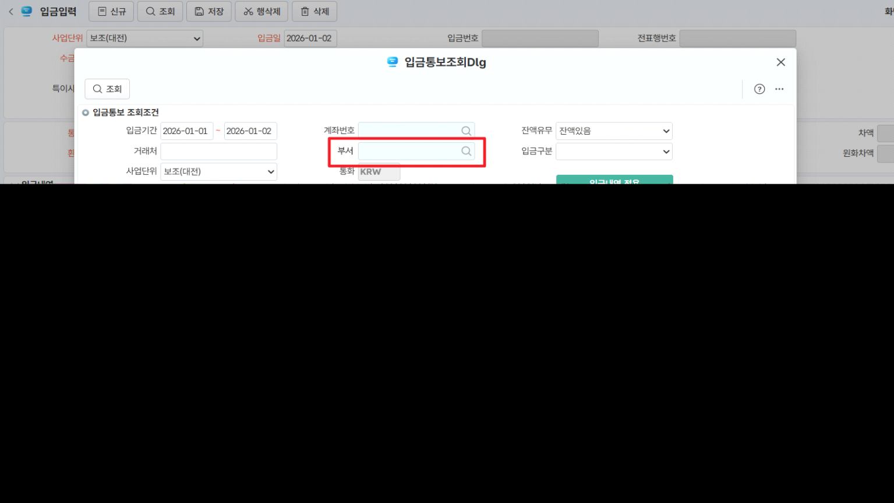

# 입금입력

금융기관지점별계좌등록에 연결된, 계좌관리분류(사용자정의코드)에 연결된 부서정보에 따라 조회가능한 계좌를 관리

\> 수출NEGO입력의 입금통보도 동일

입금통보조회Dlg 화면 조회조건 추가

1\. 선행작업: 사용자정의코드등록(계좌관리분류)에 부서 추가

\<조회조건\>

1\. 부서 : 로그인한 사원의 부서정보 (계좌관리분류에 연결된 부서 정보 확인 용)

 - 컨트롤의 부서정보 자동설

 

\<시트\>

1\. (계좌)부서: 입금계좌 다음컬럼 

\- 계좌정보 중 사용자정의코드등록(계좌관리분류)에 연결된 부서가 입력된 경우 조회

\- 입금계좌 다음컬럼 (컬럼사이즈 80)

2\. 입금계좌

\- 상단의 '부서' 조회조건에 영향을 받음

\- 공백인 경우는 영향없음. 조회조건에 부서 반영 시 사용자정의코드등록(계좌관리분류)에 연결된 부서와 일치하는 경우만 조회

 

출처: \<<https://call.sysware.co.kr/Page/Open/99740/100101/0/18820244>\>