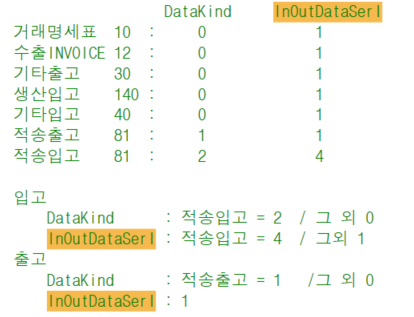
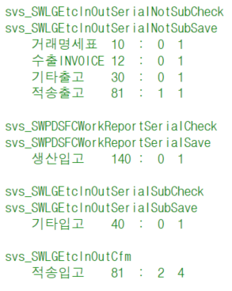
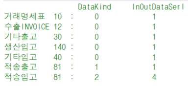

# 입출고별 DataKind / InOutDataSerl 정리

DataKind InOutDataSerl

거래명세표 10 : 0 1

수출INVOICE 12 : 0 1

기타출고 30 : 0 1

생산입고 140 : 0 1

기타입고 40 : 0 1

적송출고 81 : 1 1

적송입고 81 : 2 4

 

입고

DataKind : 적송입고 = 2 / 그 외 0

InOutDataSerl : 적송입고 = 4 / 그외 1

출고

DataKind : 적송출고 = 1 /그 외 0

InOutDataSerl : 1

 

svs_SWLGEtcInOutSerialNotSubCheck

svs_SWLGEtcInOutSerialNotSubSave

거래명세표 10 : 0 1

수출INVOICE 12 : 0 1

기타출고 30 : 0 1

적송출고 81 : 1 1

 

svs_SWPDSFCWorkReportSerialCheck

svs_SWPDSFCWorkReportSerialSave

생산입고 140 : 0 1

 

svs_SWLGEtcInOutSerialSubCheck

svs_SWLGEtcInOutSerialSubSave

기타입고 40 : 0 1

 

svs_SWLGEtcInOutCfm

적송입고 81 : 2 4

 

DataKind InOutDataSerl

거래명세표 10 : 0 1

수출INVOICE 12 : 0 1

기타출고 30 : 0 1

생산입고 140 : 0 1

기타입고 40 : 0 1

적송출고 81 : 1 1

적송입고 81 : 2 4