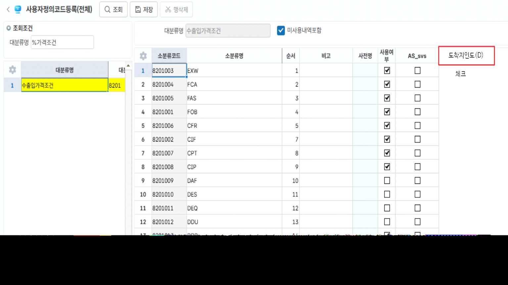
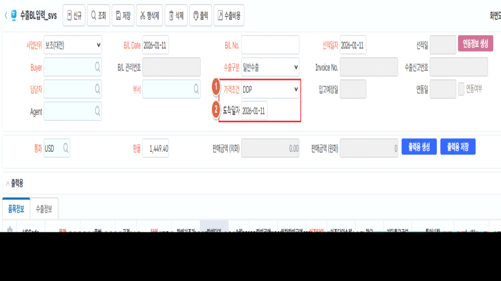
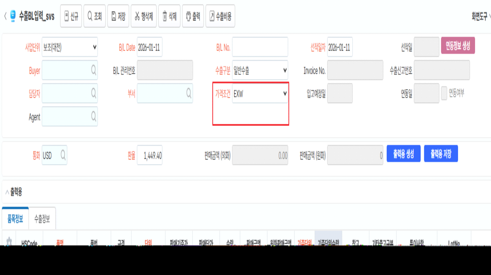

# 26.01.12 수출BL입력

1.사용자정의코드 \[수출입가격조건\]에 '도착지인도(D)' 추가항목 추가. 체크.

2\. 도착일자 컬럼 추가. 저장. (svs_TSLExpBL 테이블에 DeliveryDate-NCHAR (8) 추가)**<u>  (화면 이미지 하단 참고)</u>**

\- 컨트롤 이벤트 추가: 가격조건에 '도착지인도(D)'에 체크된 경우, 도착일자 활성화. 

3\. 도착일자가 저장된 경우에 수출매출 jump 시 매출일자에 도착일자가 반영될 수 있도록 개발



(화면 이미지)

 

미체크 시 (D조건이 아닌 경우)

\- 화면 컬럼 HID;처리



 

출처: \<<https://call.sysware.co.kr/Page/Open/100445/100101/0/18820244>\>