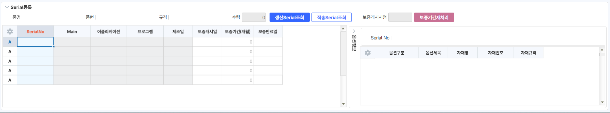

# 26.01.14 반품거래명세서입력

**1. \[조회조건\] 유통구조 DIS 항목추가**

\- 거래명세서품목조회에서 반품거래명세서로 jump 시 유통구조 자동 반영. DIS;처리

 

UMChannelName        UMChannel

 

 

 

**2. \[조회조건\] CRM생성, CRM주소**

\- 거래명세서품목조회에서 반품거래명세서로 jump 시 CRM정보 자동 반영

 

IsCRMLink CRMOrderKey

 

 

 

**3. \[시트\] 사업구분, 납품지역, 지역담당자 컬럼 추가**

\- 거래명세서품목조회에서 반품거래명세서로 jump 시 납품지역, 지역담당자 자동반영. DIS;처리

 

UMDVRegionName UMDVRegion RegionEmpName RegionEmpSeq

 

 

**4. 옵션대상, Serial대상, **Serial출력, **Serial수량** **컬럼 추가**

\- 옵션대상: 품명이 옵션 지정 품목인 경우 체크됩니다. (svs_TPDSerialBase, svs_TPDSerialExcp 테이블에 '옵션관리'에 체크된 경우)                                

                

이벤트-체크 시 배경 색 표기 '#FFF9C4'                                        

\- Serial대상: 품명이 시리얼 지정 품목인 경우 체크됩니다. (svs_TPDSerialBase, svs_TPDSerialExcp 테이블에 'Serial관리' 체크된 경우)                                                

이벤트-체크 시 배경 색 표기 '#FFF9C4'                                        

\- S/N출력: 사용자 자동기입. 별다른 이벤트 없음. 비고와 동일                                                

\- Serial수량: Serial등록된 개수를 확인 '\_TLGInOutSerialSub' 테이블 확인하여 수량 정보 표기.                                                 

 

이벤트- 이동수량과 동일하지 않은 경우 색상  표시(배경): '#FF8282'                                        

\- Serial대상에 해당하지 않는 경우 Serial수량에 따른 이벤트는 발생하지않음        

 

SVS_Clear_Serial SVS_SS1ColorAll

 

 

IsOption IsSerial SerialPrint SerialNoQty

 

 

**5.Serial등록, 옵션정보 시트(2시트, 3시트 추가)**

\- Serial입고 처리 필요

-Serial코드도움 선택 시 '거래명세서, 수출invoice' Serial코드도움이 아닌 품목의 Serial Master가 조회될 수 있도록 개발요청



 

(Serial등록 화면에 serial출고조회 버튼 추가)

 

 

출처: \<<https://call.sysware.co.kr/Page/Open/100659/100101/0/18820244>\>