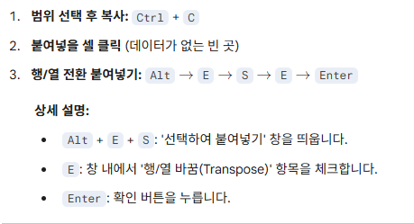

# 행열 전환

- **범위 선택 후 복사:** Ctrl + C

- **붙여넣을 셀 클릭** (데이터가 없는 빈 곳)

- **행/열 전환 붙여넣기:** Alt -\> E -\> S -\> E -\>Enter

>  
>
> 출처: \<<https://gemini.google.com/u/1/app/3958d58c13bd2d9f>\>

 

\<\<통합 문서1.xlsx\>\>