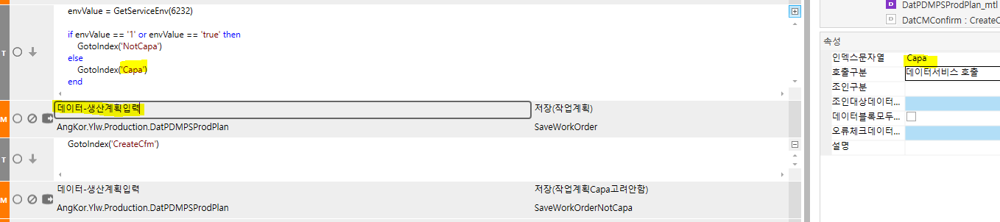
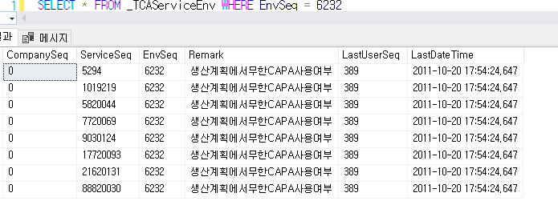

# 비즈니스에서 데이터서비스 분기 GetServiceEnv

envValue = GetServiceEnv(6232)

 

if envValue == '1' or envValue == 'true' then

> GotoIndex('NotCapa')

else

> GotoIndex('Capa')

end

 

 

 

비즈니스 새로 추가할 때는 db에서 넣어줘야함

SELECT \* FROM \_TCAService WHERE ServiceSeq = 79920153

 

SELECT \* FROM \_TCAServiceEnv \<= 테이블에 넣어줘야함

 

begin tran

 

insert into \_TCAServiceEnv values(

'0','79920153','6232','생산계획에서무한CAPA사용여부','1',getdate()

)

SELECT \* FROM \_TCAServiceEnv WHERE EnvSeq = 6232

 

rollback tran