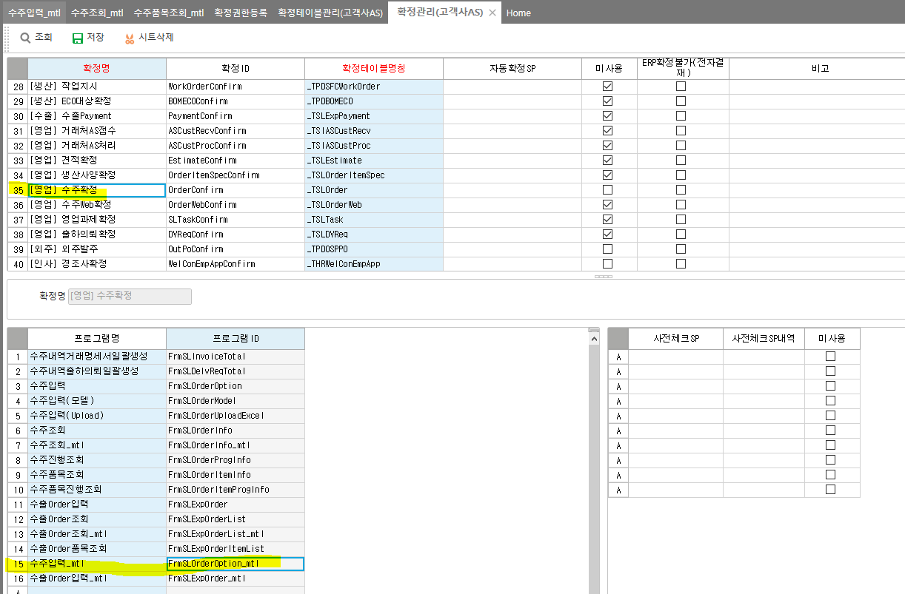

# 확정 관리 주의사항

select \* FROM \_TSLOrder_Confirm WHERE CfmSeq = 1

ㅈ

-- 혹시 빼먹고 데이터 기입했을 경우 확정 테이블에 insert (지우고 새로 만드는게 제일 좋긴함)

 

INSERT INTO \_TSLOrder_Confirm

SELECT A.CompanySeq, A.OrderSeq AS CfmSeq,0 AS CfmSerl,0 AS CfmSubSerl,6303 CfmSecuSeq, '0' IsAuto,'0' CfmCode,'' CfmDate,0 CfmEmpSeq,0 UMCfmReason, '' CfmReason, a.LastDateTime

fROM \_TSLOrder AS A LEFT OUTER JOIN \_TSLOrder_Confirm as b on A.OrderSeq = B.CfmSeq

WHERE B.CompanySeq IS NULL

 

 

에이스의 경우 자동으로 확정테이블에 데이터 넣어주지만

제뉴인에서는 확정관리 화면에 입력화면도 넣어줘야한다

조회화면만 넣으면 테이블에 데이터가 안들어감

 

에이스 확정 테이블 : \_TCOMConfirm

 

제뉴인 확정 테이블 : 테이블명_Confirm

ex. \_TSLOrder_Confirm

