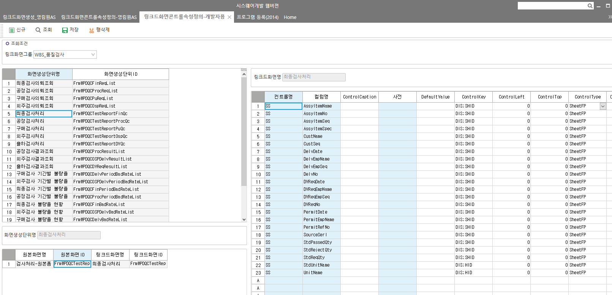

# 링크드화면 보기

링크드화면콘트롤속성정의-개발자용

 

SELECT Z.LinkGroupName

,Z.LinkGroupID

, A.LinkGroupSeq AS LinkGroupSeq -- 링크화면그룹코드

, A.OrgPgmSeq AS OrgPgmSeq -- 원본화면내부코드

, B.LinkCreateSeq AS LinkCreateSeq -- 링크화면생성내부코드

, B.PgmSeq AS PgmSeq -- 링크화면내부코드

, C.Caption AS OrgCaption -- 원본화면이름

, C.PgmId AS OrgPgmId -- 원본화면ID

, D.Caption AS Caption -- 링크화면이름

, D.PgmId AS LinkPgmId -- 링크화면ID

FROM \_TCALinkPgmGroup AS Z

JOIN \_TCALinkOrgPgm AS A WITH(NOLOCK) ON A.LinkGroupSeq = Z.LinkGroupSeq

JOIN \_TCALinkCreatePgm AS B WITH(NOLOCK) ON A.LinkGroupSeq = B.LinkGroupSeq AND A.OrgPgmSeq = B.OrgPgmSeq

LEFT OUTER JOIN \_TCAPgm AS C WITH(NOLOCK) ON A.OrgPgmSeq = C.PgmSeq

LEFT OUTER JOIN \_TCAPgm AS D WITH(NOLOCK) ON B.PgmSeq = D.PgmSeq

WHERE C.PgmId LIKE '%%' -- 원본프로그램

AND D.PgmId LIKE 'FrmWPDQCTestReportFinQc' -- 링크드프로그램

