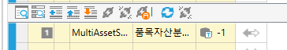
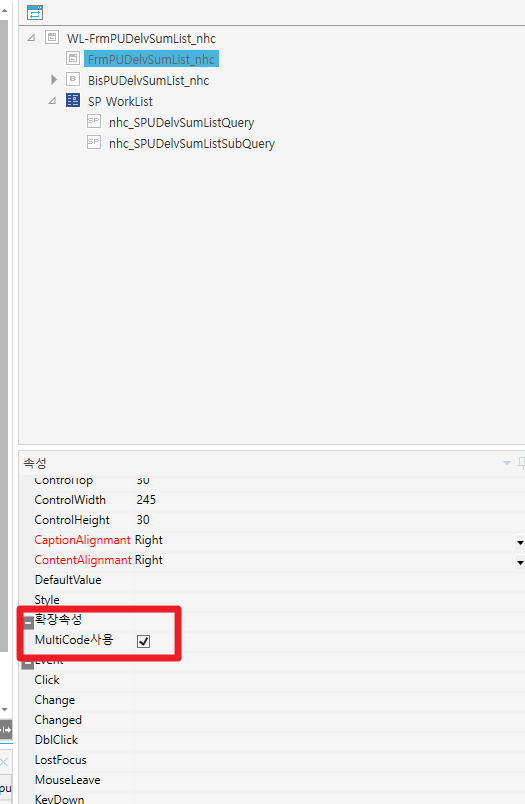
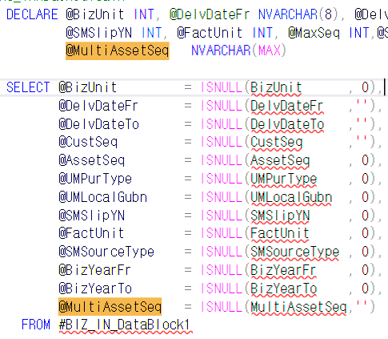
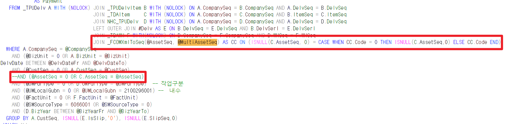

# 멀티 코드도움

참고화면 : FrmPUDelvSumList_nhc / nhc_SPUDelvSumListQuery

DECLARE @MultiAssetSeq NVARCHAR(MAX)

 

 

JOIN \_FCOMXmlToSeq(@AssetSeq, @MultiAssetSeq) AS CC ON (ISNULL(C.AssetSeq, 0) = CASE WHEN CC.Code = 0 THEN ISNULL(C.AssetSeq,0) ELSE CC.Code END)

 

