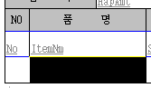
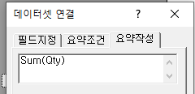

# Editor 3.0

title - 반복되지 않는 부분

data - 반복되는 부분

 

header, footer가 있고 그 안에 데이터가 있는 느낌

 

RD는 데이터베이스에 직접 접속한다

Title =\> 제목

데이터헤더 =\> 컬럼명

파란줄 = 데이터가 아래로 계속 쌓인다는걸 의미

검은줄 = 중복이 안됨 (그냥 하나만 나옴)

(왼쪽)빨간줄 = 선 굵기 조절

 

크기 조절 : 우클릭 - 개체크기맞춤

드래그해서 크기 조절하면 에러가 생길 수도 있음

(Ctrl Z 가 한번 밖에 안됨)

 

 

 

\*메뉴 및 기능

글씨체 - 맑은 고딕 (영어가 깨질 수 있으므로)

영어 - Calibri (영어의 기본 글씨체)

- 컬럼 선택

> 
>
> 옆으로 드래그 했다가 다시 복귀

 

- 필드 값 추가

오른쪽 클릭 - 데이터셋 추가

 

- 합계

> 우클릭 - 요악필드추가 =\> 하단에 합계 행 생성
>
>  
>
> 우클릭 - 데이터셋 연결 =\> 요약작성
>
> Sum(Qty)
>
> 
>
>