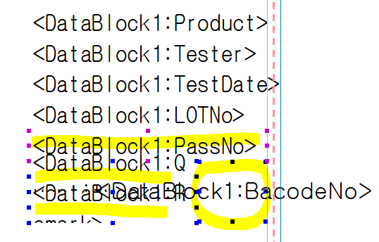
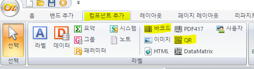
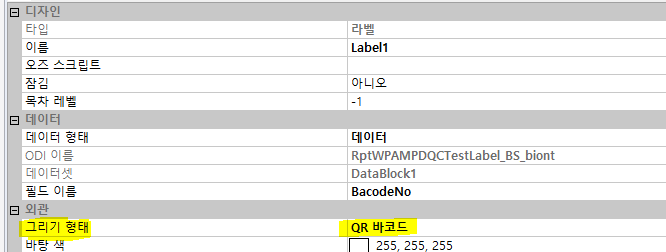
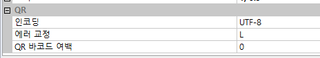

# 바코드 / QR

기존칸에 데이터가 겹칠 수 있으므로 칸을 줄임

 

컴포넌트 추가 -\> 바코드 / QR

 

속성 - 외관 - 그리기 형태 =\> 바코드 / QR 바코드 로 변경

 

- 바코드로 할 경우 주의사항

<!-- -->

- 맨 아래 QR =\> 인코딩에서

> code39 or code 128 or code128(auto)
>
> =\> 어떤 바코드 쓸지 여쭤 봐야함

- qr =\> 위에 과정 생략 (그리기 형태만)

 

바코드 값 없는 경우 안나오게 설정

 

if ( This.GetDataSetValue("DataBlock1.BarCode") == "0") {

This.SetVisible(false);

This.SetPrintable(false);

}