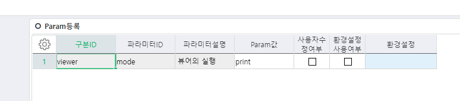

# 미리보기 없이 바로 인쇄

 

 

-- 오즈뷰어 미리보기 없이 인쇄(제뉴인 - 운영DB , 지니 - 업무DB에서 실행)

 

DECLARE @CompnaySeq INT,

@PgmSeq INT,

@PrintName NVARCHAR(200)

 

--=============================================

-- 미리보기 없이 인쇄할 법인Seq, 출력물Seq 입력

--==============================================

SELECT @CompnaySeq = ??

 

SELECT @PgmSeq = PgmSeq FROM \_TCAPgm WHERE Caption LIKE '%%'

 

SELECT @PrintName = '설정하려는 프린터이름'

 

-- 1. 미리보기없이 인쇄

Insert Into \_TCAOZReport(CompanySeq,ReportSeq,OZPSeq,OZPSerl,OZPSubSerl,OZParam,IsUserChg,IsEnv,EnvSeq,LastUserSeq,LastDateTime)

select @CompnaySeq,@PgmSeq,39,45,0,N'print',N'0',N'0',0,25147,GETDATE()

 

-- 인쇄 설정창 없이 바로 프린터로 출력

-- Silent설정시 인쇄 설정창 없이 인쇄, true로 설정시 인쇄설정창 나오도록 처리

Insert Into \_TCAOZReport(CompanySeq,ReportSeq,OZPSeq,OZPSerl,OZPSubSerl,OZParam,IsUserChg,IsEnv,EnvSeq,LastUserSeq,LastDateTime)

select @CompnaySeq,@PgmSeq,31,16,0,N'Silent',N'0',N'0',0,25147,GETDATE()

 

-- 뷰어 실행되는 프로그레스바 감추기

Insert Into \_TCAOZReport(CompanySeq,ReportSeq,OZPSeq,OZPSerl,OZPSubSerl,OZParam,IsUserChg,IsEnv,EnvSeq,LastUserSeq,LastDateTime)

select @CompnaySeq,@PgmSeq,39,86,0,N'false',N'0',N'0',0,25147,GETDATE()

 

-- 프린터 이름 설정

Insert Into \_TCAOZReport(CompanySeq,ReportSeq,OZPSeq,OZPSerl,OZPSubSerl,OZParam,IsUserChg,IsEnv,EnvSeq,LastUserSeq,LastDateTime)

select @CompnaySeq,@PgmSeq,31,27,0,@PrintName,N'0',N'0',0,25147,GETDATE()