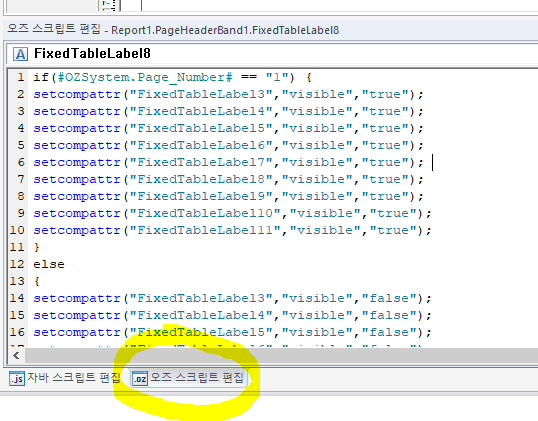

# 첫 페이지만 안나오게

1.  오즈스크립트

// 오즈 스크립트 편집 에 해야함

if(#OZSystem.Page_Number# == "1") {

setcompattr("FixedTableLabel3","visible","true");

setcompattr("FixedTableLabel4","visible","true");

setcompattr("FixedTableLabel5","visible","true");

setcompattr("FixedTableLabel6","visible","true");

setcompattr("FixedTableLabel7","visible","true");

setcompattr("FixedTableLabel8","visible","true");

setcompattr("FixedTableLabel9","visible","true");

setcompattr("FixedTableLabel10","visible","true");

setcompattr("FixedTableLabel11","visible","true");

}

else

{

setcompattr("FixedTableLabel3","visible","false");

setcompattr("FixedTableLabel4","visible","false");

setcompattr("FixedTableLabel5","visible","false");

setcompattr("FixedTableLabel6","visible","false");

setcompattr("FixedTableLabel7","visible","false");

setcompattr("FixedTableLabel8","visible","false");

setcompattr("FixedTableLabel9","visible","false");

setcompattr("FixedTableLabel10","visible","false");

setcompattr("FixedTableLabel11","visible","false");

}

 

// 제뉴인 참고 (해보진 않음)

 

var objPage = ReportTemplate.GetCurrentPage();

 

var PageInfo = objPage.GetPageIndex() + 1 ; // 현재페이지

 

if (PageInfo != 1 ) // 첫페이지 외에는 숨기기

{

> This.SetVisible(false);
>
> This.SetPrintable(false);
>
>  

}

2.  자바스크립트

// 페이지헤더에 사용하니 안 먹는 현상 =\> 오즈 스크립트로 해결

var page=This.GetDataSetValue("OZSystem.Page_Number"); // 페이지번호 가져오기

if (page \> 1 ) // 페이지가 1보다 클때

{

This.SetEnable(false); // 숨기기 false

}