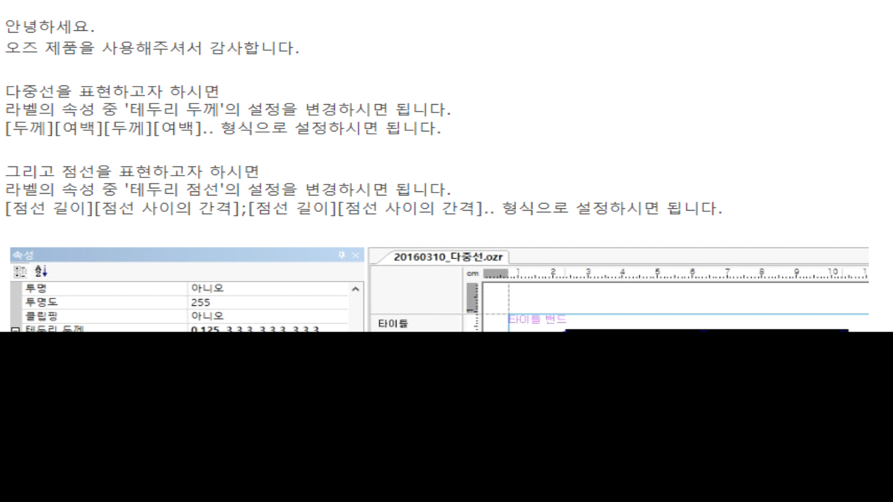

# 두줄

안녕하세요.

오즈 제품을 사용해주셔서 감사합니다.

 

다중선을 표현하고자 하시면

라벨의 속성 중 '테두리 두께'의 설정을 변경하시면 됩니다.

\[두께\]\[여백\]\[두께\]\[여백\].. 형식으로 설정하시면 됩니다.

 

그리고 점선을 표현하고자 하시면

라벨의 속성 중 '테두리 점선'의 설정을 변경하시면 됩니다.

\[점선 길이\]\[점선 사이의 간격\];\[점선 길이\]\[점선 사이의 간격\].. 형식으로 설정하시면 됩니다

