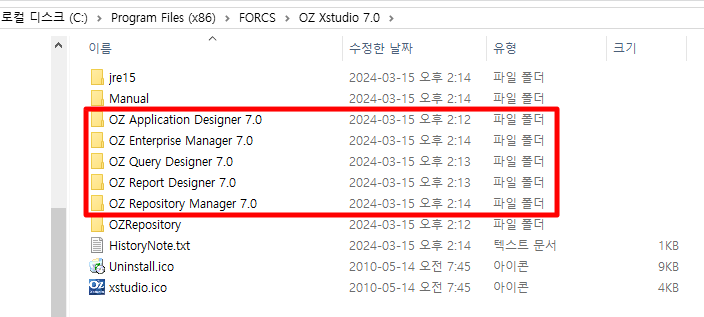
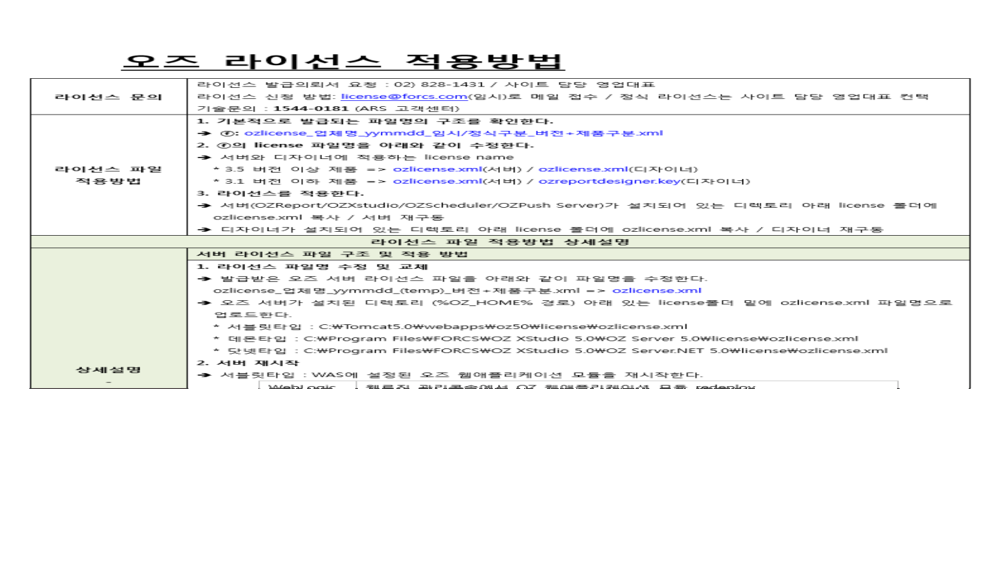
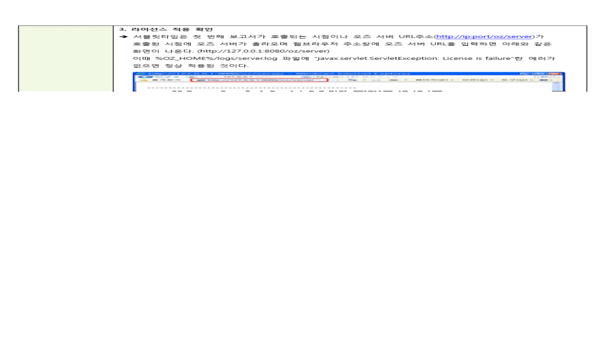
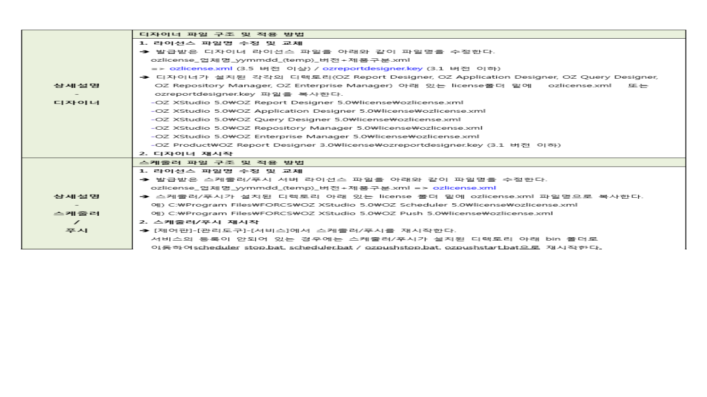

# \<\<ozlicense_영림원_250117_7.0.zip\>\>\<\<ozlicense.xml\>\>\<\<ozlicense적용방법.pdf\>\>

C:\Program Files (x86)\FORCS\OZ e-Form 6.0\OZ Query Designer 6.0\license

 

 

C:\Program Files (x86)\FORCS\OZ Xstudio 7.0\OZ Query Designer 7.0\license

 

 

